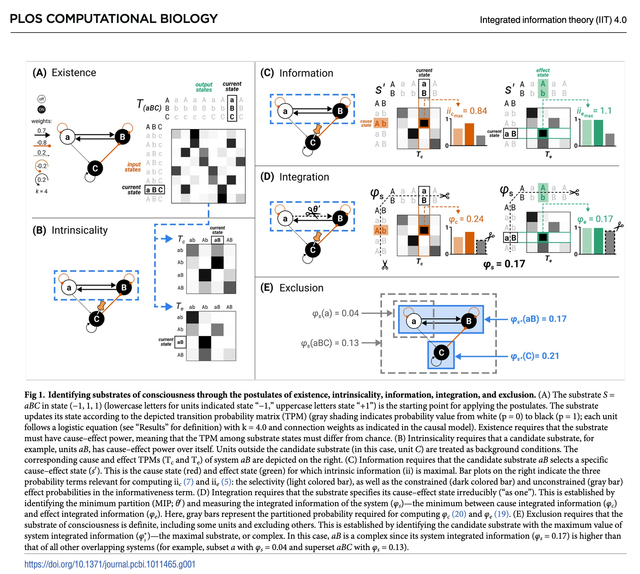
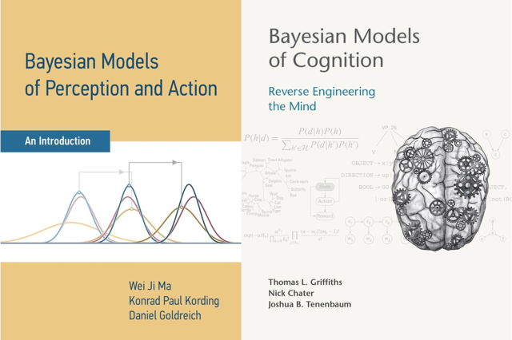
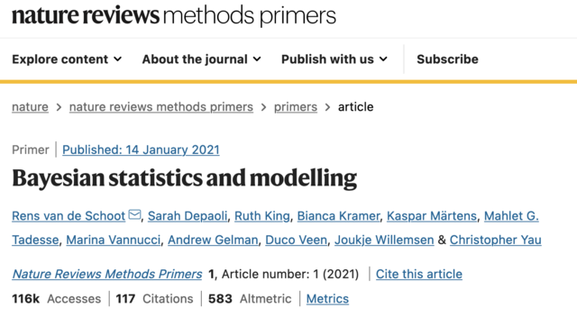
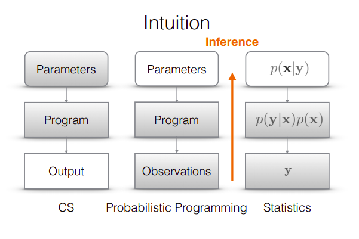
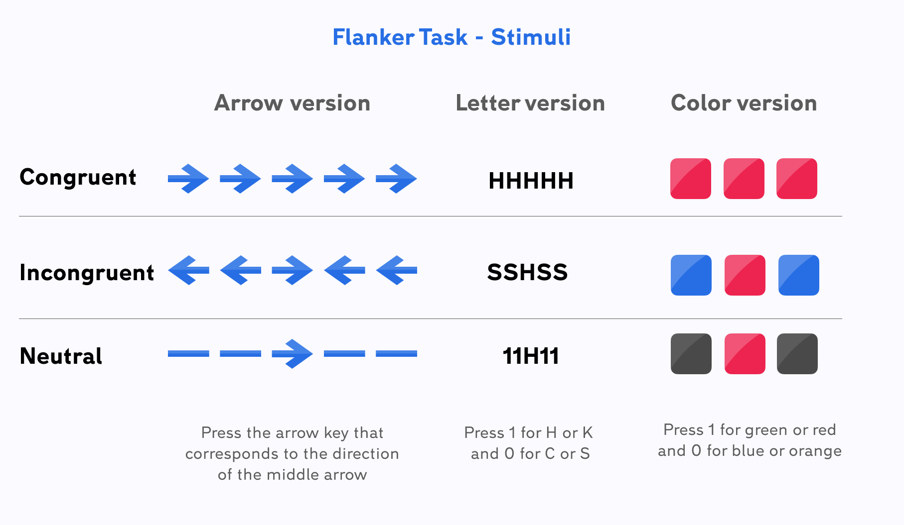
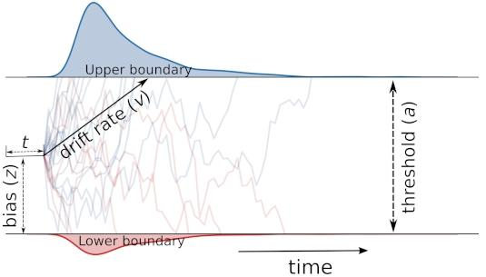
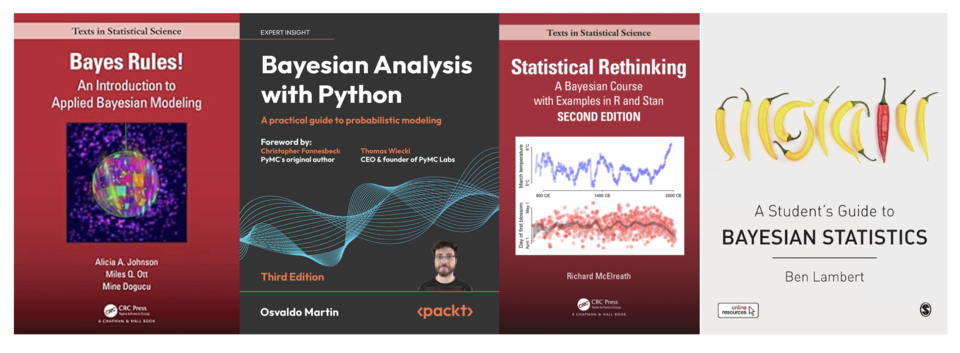

```{r}
#| include: false
smoke_test <- Sys.getenv("SMOKE_TEST", "false") == "true"
dir.create("tmpdata", showWarnings = FALSE)  # brms file= 缓存目录 (已被 .gitignore 忽略)
```

## Outlines

- **1. 为什么要学习本课程** — Why Bayesian inference
- **2. 本课程的内容** — What is the syllabus
- **3. 如何学好这门课** — How can I learn this course well

## 为什么要学习本课程 (Why Bayesian statistics)

研究人类心理与行为的规律，容易吗？

## 1.1 为什么心理学需要更好的方法 (Why does psychological science need better methods?)

**原因1：人类认知与行为本身的复杂性**


Source: <https://www.science.org/toc/science/309/5731>

## 复杂科学问题一览 (Science's 125 questions)

- **Q1: What is the Universe made of?** (physics)
- **Q2: What is the biological basis of consciousness?** (psychology/cognitive science)
- **Q: 重要性和复杂度相似的问题，是否意味着研究方法也应该类似地复杂？**

## 物理学中的方法 (Methods in Physics)

**Example 1: Webb telescope (韦伯望远镜)** —— *equipment*


## 物理学中的方法 (Methods in Physics)

**Example 2: Big-team science (CERN)** —— *equipment & practices*

**Example 3: Mathematics**

## 其他研究"智能"的领域所采用的方法

### AI


## 意识研究在过去十多年中的方法

### 整合信息理论 (Integrated Information Theory, IIT)



## 心理科学的研究方法 (What do psychological scientists have?)

> 你们能够想到的研究方法包括哪些？


## 心理科学的方法清单

**实证研究：**

- 质性研究
- 观察法
- 问卷
- 行为实验
- 眼动、生理数据记录
- EEG/ERP/MEG
- fMRI/PET/fNIRs
- TMS/tDCS
- ...

## 心理科学的方法清单 (续)

**统计方法：**

- *t*-test
- ANOVA
- Correlation
- Structural equation model (SEM)
- ?

**相关方法课程：**

- 心理测量
- 心理统计（包括SPSS等）
- 实验心理学（包括E-prime等）
- ?

## 心理学如何变得更好？

- 更好的仪器
- **更好的统计/数据分析**
- 更好的实践 (e.g., big-team science)

## 1.1 原因2：更复杂的数据

- 数据数字化的时代，大数据
- 神经成像/生理数据
- 多模态的数据融合
- ...

## 1.1 原因3：贝叶斯是认知建模的主流模型之一



## 1.2 确实有更好的统计方法与工具

### 贝叶斯统计 (Bayesian statistics)



## 贝叶斯统计的特点

- **通用**：贝叶斯推断在多个学科特别是AI领域得到了广泛应用。
- **灵活**：结合先验知识与新数据，灵活调整模型以适应不同数据情境。
- **强大**：与频率主义学派相比，贝叶斯方法适用范围更广。

## （相对）易用：概率编程语言 (PPLs)

概率编程语言（Probabilistic Programming Languages, PPLs）的发展和普及

> PPLs: *computational languages for statistical modeling*

- **R**: Stan, JAGS
- **Python**: PyMC, NumPyro
- **Julia**: Mamba, Turing.jl
- BUGS
- ...

大部分情况下，开发者使用它可以轻松地定义概率模型，然后程序会自动地求解模型。



Source: <https://towardsdatascience.com/intro-to-probabilistic-programming-b47c4e926ec5>

## 可拓展

贝叶斯概念已经应用到以深度学习为中心的新技术的发展，包括深度学习框架 (TensorFlow, Pytorch)，创建能力更强、数据驱动的模型。

## 方便交流

大部分PPLs都有类似的数据结构，但是不同的学科使用的语言不同。

心理学 / 社会科学 / 神经科学：

- **PyMC** (bambi)
- **Stan** (brms)
- **BUGS**

## 三个实例 (Three examples)

从三个实际例子看贝叶斯方法如何解决问题：

1. 例1：社会关系地位与幸福感——贝叶斯因子代替 *t*-检验
2. 例2：贝叶斯分层模型——更准确地估计信度
3. 例3：贝叶斯推断在认知模型中的应用 (DDM)


## 例1：社会关系地位与幸福感的关系

实例的数据来自 [Many Labs 2 项目](https://osf.io/uazdm/) 中的一个研究（Anderson et al., 2012）。

该研究探究了社会关系地位对于幸福感的影响：“Sociometric status and well-being”。

该数据集包括 6905 个被试的数据。

::: {style="font-size:12px; margin-top:0.5em"}
Anderson et al. (2012), *Psychological Science*
:::

## 例1：环境准备

```{r}
#| code-fold: true
#| code-summary: "展开代码"
# Packages
options(repos = c(CRAN = "https://mirrors.tuna.tsinghua.edu.cn/CRAN/"))
if (!requireNamespace('pacman', quietly = TRUE)) {
    install.packages('pacman')
}
#install.packages(c("StanHeaders","rstan"),type="source")
```

```{r}
#| code-fold: true
#| code-summary: "展开代码"
pacman::p_load("tidyverse","ggplot2","dplyr","car","ggpubr",'rstan',
               "BayesFactor","bayestestR","gridExtra","TOSTER",'papaja')
#               'brms','bayesplot','posterior')
```

```{r}
#| error: true
packageVersion('bruceR')
```

## 例1：导入数据

```{r}
#| code-fold: true
#| code-summary: "展开代码"
options(warn = -1)  # 抑制警告

#导入数据
SMS_data <- tryCatch({
  read.csv('/home/mw/input/bayes3797/SMS_Well_being.csv')
}, error = function(e) {
  read.csv('data/SMS_Well_being.csv')
})
```

```{r}
SMS_data <- SMS_data %>% 
    select(uID, variable, factor, Country)
    
#查看数据
print(head(SMS_data, 2))
```

## 例1：可视化——高低社会关系地位的幸福感分布

```{r}
ggplot(data = SMS_data, aes(factor,variable))+
  geom_violin(aes(fill=factor))+
  geom_boxplot(width=0.2,outlier.shape = NA)+
  guides(col="none")+
  papaja::theme_apa()
```

## 例1：传统统计检验的步骤

经典做法通常包含三步：

1. **方差齐性检验**（Levene's test）
2. **独立样本 *t* 检验**
3. **各组描述性统计**

## 例1：方差齐性检验 (Levene's test)

```{r}
# 方差齐性检验（输出p值）
levene_res <- car::leveneTest(variable ~ factor,
                data = SMS_data)
levene_p <- levene_res$`Pr(>F)`[1]
round(levene_p, 3)
```

## 例1：独立样本 *t* 检验

```{r}
# 独立样本t检验
ttest_res <- t.test(variable ~ factor, data = SMS_data, var.equal = TRUE)
ttest_res
```

## 例1：各组描述性统计

```{r}
#3.各组描述性统计
SMS_data_sum <- SMS_data %>%
  dplyr::group_by(factor) %>%
  dplyr::summarise(mean = mean(variable),
                   sd = sd(variable)) 

SMS_data_sum
```

```{r}
SMS_data_sum$mean[SMS_data_sum$factor=="High"]
```

## 例1：传统方法的局限——*p* 值不能做什么

- 低社会地位组 (*M* = 0.014, *SD* = 0.66) 与高社会地位组 (*M* = −0.014, *SD* = 0.67) 差异不显著，*t* = 1.76, *p* = 0.079。
- 在传统显著性水平 (α = 0.05) 下，我们**无法拒绝** $H_0$。
- 但 *p* = 0.079 意味着"数据支持 $H_0$"吗？**不能。**

## 例1：等效性检验 (TOST)

[Two one-sided tests (TOST)](https://aaroncaldwell.us/TOSTERpkg/) 是一种常用于等效性检验 (equivalence tests) 的方法，其目的是评估两个组之间的差异是否可以被视为"相等"。

- 等效性被定义为组间差异位于预先设定的"等效边界"范围内；
- 本例将等效边界设定为 **0.2**（bound = 0.2）：若两组差异不超过 0.2，即可认为它们等效；
- 检验得出的 *p* 值表明有非常强的证据表明这两组之间的差异在等效边界之内。

```{r}
# 双单侧检验（TOST）
#！！这里的tsum_TOST函数基于汇总统计数据而非原始数据进行检验
#！！跑出来的p值=2.87e-46与python代码中的p值（2.265256e-27）不一致，但结果都是显著的
n_high <- nrow(SMS_data %>% filter(factor == 'High'))
n_low <- nrow(SMS_data %>% filter(factor == 'Low'))
tost_res <- tsum_TOST(
  m1=SMS_data_sum$mean[SMS_data_sum$factor=="High"],sd1=SMS_data_sum$sd[SMS_data_sum$factor=="High"], n1=n_high,
  m2=SMS_data_sum$mean[SMS_data_sum$factor=="Low"],sd2=SMS_data_sum$sd[SMS_data_sum$factor=="High"], n2=n_low,
  eqb = 0.2
  )
print(tost_res)
```

## 例1：用贝叶斯因子替代 *t* 检验

在传统的零假设显著性检验（Null Hypothesis Significance Testing, NHST）框架之下，*t* 检验只提供了一个二分的结果：**拒绝**或**无法拒绝** $H_0$。

- 但 *p* = 0.079 这样的结果**无法支持** $H_0$；
- 贝叶斯因子（Bayes Factor, BF）提供了一种更直观、渐进的方式来评估数据支持原假设 $H_0$ 还是备择假设 $H_1$。

## 例1：计算贝叶斯因子

```{r}
##贝叶斯因子（r值 = 0.707）
BF_sms <- ttestBF(x = SMS_data$variable[SMS_data$factor=="Low"], 
                  y = SMS_data$variable[SMS_data$factor=="High"], r = 0.707)
print(BF_sms)
```

## 例1：解读贝叶斯因子

贝叶斯因子为 $BF_{10}$ = 0.127，或者 $BF_{01}$ = 1/0.127 = 7.87，这表明当前数据**支持零假设** $H_0$，说明高低社会关系地位组之间的社会关系效应没有显著差异。

::: {style="font-size:0.85em"}
| 贝叶斯因子 $BF_{01}$ | 解释标准                |
|----------------------|-------------------------|
| > 100                | 极强的证据支持 $H_0$    |
| 30 ~ 100             | 非常强的证据支持 $H_0$  |
| 10 ~ 30              | 较强的证据支持 $H_0$    |
| 3 ~ 10               | 中等程度的证据支持 $H_0$|
| 1 ~ 3                | 较弱的证据支持 $H_0$    |
| 1                    | 没有证据                |
| 1/3 ~ 1              | 较弱的证据支持 $H_1$    |
| 1/10 ~ 1/3           | 中等程度的证据支持 $H_1$|
| 1/30 ~ 1/10          | 较强的证据支持 $H_1$    |
| 1/100 ~ 1/30         | 非常强的证据支持 $H_1$  |
| < 1/100              | 极强的证据支持 $H_1$    |
:::

::: {style="font-size:12px; margin-top:0.4em"}
胡传鹏 等 (2016), *心理科学进展*
:::

## 贝叶斯推断 (Bayesian Inference)

> 贝叶斯因子背后的模型是怎么来的呢？

一个简单的线性模型：

1. 通过建立线性模型去替代原本的 *t* 检验模型；
2. 通过 PyMC / Stan 对后验进行采样；
3. 通过 Arviz 等工具对结果进行展示，辅助统计推断。

## 例1：把 *t* 检验写成线性模型

$x$ 为自变量，其中 **1 = 低社会关系**，**0 = 高社会关系**。

- 参数 $\beta_0$ 是线性模型的**截距**：代表高社会关系地位被试的幸福感；
- 参数 $\beta_1$ 是**斜率**：截距加上斜率 = 低社会关系地位被试的幸福感；
- 参数 $\sigma$ 是**残差**（标准差），因变量 $y$ 即主观幸福感。

```{r}
##通过Rstan建立基于贝叶斯的线性模型
#1.准备数据
x <- as.integer(factor(SMS_data$factor)) - 1  # 将 'High' 和 'Low' 转换为 0 和 1 对应的整数
```

## 例1：Stan 中的模型定义

```{r}
#2.Stan 模型
stan_model_code <- "
data {
  int<lower=0> N;               
  vector[N] y;                  
  vector[N] x;                  
}

parameters {
  real beta0;                   
  real beta1;                  
  real<lower=0> sigma;          
}

model {
  beta0 ~ normal(0, 5);        
  beta1 ~ normal(0, 0.707); 
  sigma ~ cauchy(0, 2);        

  y ~ normal(beta0 + beta1 * x, sigma);
}
"
```

## 例1：先验抽样模型

Stan 中不能直接查看先验抽样，因此重新定义一个不含似然函数的模型用于抽样：

```{r}
#先验抽样模型（stan中不能直接查看先验抽样，因此重新定义一个不含似然函数的模型用以抽样）
stan_model_prior <- "
data {
  int<lower=0> N;               
  vector[N] y;                  
  vector[N] x;                  
}

parameters {
  real beta0;                   
  real beta1;                  
  real<lower=0> sigma;          
}

model {
  beta0 ~ normal(0, 5);        
  beta1 ~ normal(0, 0.707); 
  sigma ~ cauchy(0, 2);
  // 不定义似然函数
}
"
```

## 例1：数据准备与先验采样

```{r}
#3.数据准备
stan_data <- list(N = nrow(SMS_data), x = x, y = SMS_data$variable)

#4.进行先验采样 (smoke test 时减小迭代量以快速验证)
prior_checks <- stan(model_code = stan_model_prior, 
            data = stan_data, 
            iter = if (smoke_test) 100 else 5000, 
            warmup = if (smoke_test) 50 else 0,
            chains = if (smoke_test) 1 else 1,
            seed = 202409)
prior_samples <- rstan::extract(prior_checks)
```

## 例1：后验采样

```{r}
#5.进行后验采样 (smoke test 时减小迭代量以快速验证)
m1 <- stan(model_code = stan_model_code, 
            data = stan_data, 
            iter = if (smoke_test) 100 else 2000, 
            warmup = if (smoke_test) 50 else 1000, 
            chains = if (smoke_test) 1 else 4, 
            control = list(adapt_delta = 0.9), 
            seed = 202409,
            refresh = 0)  # 不显示采样进度, 避免冗长输出撑爆页面
idata <- rstan::extract(m1)
```

```{r}
print(m1)
```

## 例1：收敛诊断——轨迹图 (traceplot)

```{r}
#轨迹图
pacman::p_load('rstan','coda')

# 将 stanfit 对象转换为 mcmc.list 对象
mcmc_m1 <- As.mcmc.list(m1)

# 用 2x2 布局将多个参数面板合并到同一张图 (避免每个参数输出一张超高图)
par(mfrow = c(2, 2))
traceplot(mcmc_m1)
```

## 例1：先验分布图 (prior)

```{r}
##抽样分布可视化
#将样本转换成数据框
prior_df <- data.frame(beta1 = prior_samples$beta1)
posterior_df <- data.frame(beta1 = idata$beta1)

#先验分布图
prior_plot <- ggplot(prior_df, aes(x = beta1)) +
  geom_density(fill = "lightblue", alpha = 0.5) +
  labs(title = "Prior", x = "beta1", y = "Density") +
  papaja::theme_apa()
```

## 例1：后验分布图 (posterior)

```{r}
#后验分布图
posterior_plot <- ggplot(posterior_df, aes(x = beta1)) +
  geom_density(fill = "orange", alpha = 0.5) +
  labs(title = "Posterior", x = "beta1", y = "Density") +
  papaja::theme_apa()

#并排显示
grid.arrange(prior_plot, posterior_plot, nrow = 1, ncol = 2)
```

## 例1：先验 vs 后验——数据如何更新信念

```{r}
#| code-fold: true
#| code-summary: "展开代码"
##使用ggplot进行可视化
#获取后验分布的密度
posterior_density <- density(posterior_df$beta1)
prior_density <- density(prior_df$beta1)

#将密度结果转为数据框
posterior_density_df <- data.frame(x = posterior_density$x, Density = posterior_density$y)
prior_density_df <- data.frame(x = prior_density$x, Density = prior_density$y)

#绘图
p <- ggplot() +
  # 绘制后验分布曲线
  geom_line(data = posterior_density_df, aes(x = x, y = Density), color = "orange") +
  # 绘制先验分布曲线
  geom_line(data = prior_density_df, aes(x = x, y = Density), color = "blue") +
  # 设置x轴范围
  xlim(-0.5, 0.5) +
  # 添加标签
  labs(x = "beta1 \n(represents the difference \nbetween two groups)") +
  # 添加垂直线
  geom_vline(xintercept = 0, color = "red", linetype = "dashed") +
  # 设置背景颜色
  papaja::theme_apa()
# 显示图形
print(p)
```

> 后验分布相比先验分布**更窄**且**更接近 0**：数据让我们的信念从不确定走向确定。

## 例1：小结

- 传统检验告诉我们"差异**不显著**"（*p* = 0.079），但无法告诉我们 $H_0$ 是否被支持；
- TOST 与贝叶斯因子则能提供**支持 $H_0$（等效）的证据**；
- 把 *t* 检验写成线性模型（Bayesian linear model），可进一步得到 $\beta_1$ 的**完整后验分布**，从而做更灵活的推断。


## 例2：贝叶斯分层模型可以更准确地估计信度

在前面的内容中，我们通过社会关系地位（高与低）对幸福感的影响进行了可视化，并使用贝叶斯因子和贝叶斯推断对模型进行了进一步的分析。

现实世界的数据往往存在**分层结构**（例如，数据可能来自不同的群体、地区、时间段等）。如何更好地处理数据内在的层次结构、更加准确地估计出感兴趣的效应（如社会关系地位对幸福感的影响），正是**分层模型**（Hierarchical/Multi-level Model）所能解决的。

## 例2：分层模型的特殊运用——信度估计

例2的数据来源于 Haines et al. (2025)。

本文的研究问题是：**认知任务作为测量个体差异的工具，是否真的信度很差？**

::: {style="font-size:12px; margin-top:0.5em"}
Haines et al. (2025), *Psychological Methods*
:::

## 例2：Flanker 任务数据

:::: {.columns}
::: {.column width="58%"}
例2数据集包括 Flanker 任务中的反应时间 (RT) 和正确率数据。Flanker 任务要求被试对中央箭头的方向作出反应，同时忽略周围的干扰箭头。

- **反应时间 (RT)**：以秒为单位，记录每次试验的反应时间；
- **正确率 (Correct)**：记录被试反应是否正确；
- **条件 (Condition)**：任务分为一致 (congruent) 和不一致 (incongruent) 试验，箭头方向是否一致会影响被试的反应时间；
- **试验与区块**：任务分为多个区块，每个区块包含一系列试验。
:::
::: {.column width="42%"}
<div style="text-align: center;">

<p style="font-size:12px">图源: <a href="https://www.testable.org/experiment-guides/executive-function/flanker-task">Testable</a></p>
</div>
:::
::::

## 例2：导入数据与环境准备

```{r}
#导入数据
df_flanker <- tryCatch({
  read.csv('/home/mw/input/bayes3797/flanker_1.csv')
}, error = function(e) {
  read.csv('data/flanker_1.csv')
}) 
```

```{r}
# 加载所需要的包
pacman::p_load("dplyr","tidyr","ggplot2","patchwork","tibble","brms","tidybayes")
```

## 传统方法：初测-重测的相关系数 (Two-stage model)

"信度"最朴素的操作化：**同一批人在两个时间点（t1, t2）的表现有多相关？**

做法分两步（two-stage）：

1. **Stage 1**：把每个被试的原始试次数据压缩成"分数"（如 RT 的均值 / 标准差，以及一致性效应的对比值）；
2. **Stage 2**：计算这些分数在 t1 与 t2 之间的相关系数。

## 例2：Two-stage 数据预处理

```{r}
#| code-fold: true
#| code-summary: "展开代码"
# 加载数据
df_flanker <- read.csv('data/flanker_1.csv')

# 假设 df_flanker 是原始数据框
df_trad <- df_flanker

# 选择反应时大于 0 且条件不为 1 的行，并重置索引
df_trad <- df_trad[df_trad$RT > 0 & df_trad$Condition != 1, ]
df_trad <- df_trad[!duplicated(row.names(df_trad)), ]  # 避免索引重复

# 将条件进行重新编码，2 为不一致，0 为一致
df_trad$Condition <- ifelse(df_trad$Condition == 2, "incon", "con")

# 将时间变量进行重新编码
df_trad$Time <- ifelse(df_trad$Time == 1, "t1", ifelse(df_trad$Time == 2, "t2", df_trad$Time))

# 根据条件分组，计算每个组内 RT 的均值和标准差
df_trad <- df_trad %>%
  group_by(subj_num, Condition, Time) %>%
  summarise(mean = mean(RT), std = sd(RT), .groups = "drop")

# 将数据转成长数据（宽格式转长格式）
df_trad <- df_trad %>%
  pivot_wider(names_from = c(Condition, Time), values_from = c(mean, std))

# 处理列名
col_names <- colnames(df_trad)
new_col_names <- sapply(col_names, function(x) {
  if (x == "subj_num") {
    return("subj_num")
  } else {
    parts <- strsplit(x, "_")[[1]]
    return(paste(parts[1], parts[2], parts[3], sep = "_"))
  }
})
colnames(df_trad) <- new_col_names

# 关注平均值、标准差的差值
df_trad$mean_contrast_t1 <- df_trad$mean_con_t1 - df_trad$mean_incon_t1
df_trad$mean_contrast_t2 <- df_trad$mean_con_t2 - df_trad$mean_incon_t2
df_trad$sd_contrast_t1 <- df_trad$std_con_t1 - df_trad$std_incon_t1
df_trad$sd_contrast_t2 <- df_trad$std_con_t2 - df_trad$std_incon_t2

# 选择需要的列
df_trad <- df_trad[, c("subj_num", "mean_contrast_t1", "mean_contrast_t2", "sd_contrast_t1", "sd_contrast_t2")]

print(df_trad)
```

## 例2：计算初测-重测相关系数

```{r}
#| code-fold: true
#| code-summary: "展开代码"
# 定义计算皮尔逊相关系数的函数
pearson_df <- function(method, var, col1, col2) {
  # 计算皮尔逊相关系数
  corr_result <- cor.test(
    x = col1, 
    y = col2, 
    method = "pearson"
  )
  
  # 提取核心结果
  contrast_coef <- as.numeric(corr_result$estimate)  # 相关系数
  ci_low <- as.numeric(corr_result$conf.int[1])  # 置信区间下限
  ci_high <- as.numeric(corr_result$conf.int[2]) # 置信区间上限
  
  # 构建结果数据框
  result_df <- tibble(
    mean = contrast_coef,
    hdi_2.5 = ci_low,
    hdi_97.5 = ci_high,
    level1 = "Two-Stage",
    level2 = paste0(method, "_", var)
  ) 
  
  return(result_df)
}
```

```{r}
# 计算 mean（均值）的时间点相关
trad_mu <- pearson_df(
  method = "pearson",
  var = "mean",
  col1 = df_trad$mean_contrast_t1,  # time1 均值差异列
  col2 = df_trad$mean_contrast_t2   # time2 均值差异列
)

# 计算 sd（标准差）的时间点相关
trad_sigma <- pearson_df(
  method = "trad",
  var = "sd",
  col1 = df_trad$sd_contrast_t1,    # time1 标准差差异列
  col2 = df_trad$sd_contrast_t2     # time2 标准差差异列
)

# 合并结果
trad_result <- bind_rows(trad_mu, trad_sigma) 


trad_result <- trad_result %>%
  mutate(
    level2 = case_when(
      level2 == "trad_mean" ~ "mu",   
      level2 == "trad_sd" ~ "sigma", 
      TRUE ~ level2 
    )
  )

print(trad_result)
```

## 分层的广义线性模型

传统方法把每个被试"压"成一个点，丢失了大量信息，而且估计出的信度往往很低。

分层模型则直接在**试次水平**上建模，让信度成为模型中的一个参数。

```{r}
#| code-fold: true
#| code-summary: "展开代码"
df_model <- df_flanker %>%
  # 筛选有效数据 & 编码Condition
  dplyr::filter(RT > 0, Condition != 1) %>%
  # 1=不一致，0=一致
  dplyr::mutate(Condition = ifelse(Condition == 2, 1, 0)) %>%  
  # 编码Time
  dplyr::mutate(Time = ifelse(Time == 1, 0, 1)) %>%
  dplyr::mutate(Time = factor(Time, levels = c(0, 1))) %>%  
  # 生成试次索引 & 被试编号
  dplyr::mutate(trial_idx = dplyr::row_number() - 1) %>%
  dplyr::mutate(subj_num = subj_num - 1)

df_model <- df_model %>%
  # 创建交互变量
  # 将时间 × 条件的组合效应拆解为可单独建模的变量
  dplyr::mutate(
    CxT_T0 = ifelse(Time == 0 & Condition == 1, 1, 0),
    CxT_T1 = ifelse(Time == 1 & Condition == 1, 1, 0)
  )

# 计算每个被试在不同时间点的RT最小值
rt_min <- df_model %>%
  dplyr::group_by(subj_num, Time) %>%
  dplyr::summarise(min_RT = min(RT), .groups = "drop") %>%  
  tidyr::pivot_wider(names_from = Time, values_from = min_RT) %>%
  dplyr::select(-subj_num) %>%
  as.matrix() 
```

## 例2：设定分层模型

这里使用 **shifted lognormal** 分布对 RT 建模（不做非决策时间 ndt 的建模，lognormal 无偏移项）：

```{r}
# 为简化模型，不包含对ndt的建模，使用 lognormal，无偏移项
model_formula <- brms::bf(
  # mu 部分：固定效应包含两个时间点的条件效应；
  # 随机效应包含两个独立项（CxT_T0 和 CxT_T1）
  RT ~ 1 + CxT_T0 + CxT_T1 + 
    (0 + CxT_T0 + CxT_T1 | subj_num),  # 0 + 表示无随机截距，仅保留两个时间点的随机效应
  # sigma 部分同理
  sigma ~ 1 + CxT_T0 + CxT_T1 + 
    (0 + CxT_T0 + CxT_T1 | subj_num),
  family = shifted_lognormal()
)
```

## 例2：设定先验分布

```{r}
# 查看模型的所有参数
# get_prior(
#   formula = model_formula,
#   data = df_model,
#   family = lognormal()
#   family = shifted_lognormal()
# )

# 为随机效应的协方差矩阵指定LKJ先验（匹配PyMC的rho_R_mu的先验）
prior <- c(
  # mu 的固定效应先验
  prior(normal(0, 1), class = "b", dpar = "mu"),
  # mu 的随机效应：标准差 + 相关矩阵
  prior(normal(0, 1), class = "sd", dpar = "mu", group = "subj_num", lb = 0),
  prior(lkj(1), class = "cor", dpar = "mu", group = "subj_num"),
  
  # sigma 的固定效应先验
  prior(normal(0, 1), class = "b", dpar = "sigma"),
  # sigma 的随机效应
  prior(normal(0, 1), class = "sd", dpar = "sigma", group = "subj_num", lb = 0)
)
```

## 例2：拟合先验模型（先验预测）

```{r}
# 拟合一个不使用数据的先验模型，用于先验预测 (smoke test 时减小迭代量)
prior_fit <- brms::brm(
  formula = model_formula,
  data = df_model,
  family = lognormal(),
  prior = prior,
  sample_prior = "only",  # 仅从先验分布采样
  chains = 1,
  iter = if (smoke_test) 100 else 1000,
  warmup = if (smoke_test) 50 else 500,
  refresh = 0,  # 不显示迭代过程
  file = if (smoke_test) "tmpdata/prior_fit_smoke" else "tmpdata/prior_fit"
)
```

```{r}
#| code-fold: true
#| code-summary: "展开代码"
# 提取先验样本（固定效应部分）
prior_draws <- posterior_samples(prior_fit)
  
# 明确指定需要提取的四个参数，可通过 posterior_samples(prior_fit) 查看
target_params <- c("b_CxT_T0", "b_CxT_T1", "b_sigma_CxT_T0", "b_sigma_CxT_T1")
  
# 转换为长格式数据
prior_long <- prior_draws %>%
select(all_of(target_params)) %>%
tidyr::pivot_longer(cols = everything(), names_to = "parameter", values_to = "value")

# 分别创建 mu 和 sigma 的图形
# mu 相关参数：b_CxT_T0, b_CxT_T1
mu_params <- c("b_CxT_T0", "b_CxT_T1")
mu_params <- intersect(mu_params, target_params)

p1 <- if (length(mu_params) > 0) {
  prior_long %>%
    filter(parameter %in% mu_params) %>%
    # 重命名参数
    mutate(
      parameter = case_when(
        parameter == "b_CxT_T0" ~ "Time1",
        parameter == "b_CxT_T1" ~ "Time2",
      )
    ) %>%
    ggplot2::ggplot(aes(x = value)) +
    ggplot2::geom_density(
      color = "#1f77b4", 
      alpha = 0.3, 
      linewidth = 0.7  
    ) +
    ggplot2::facet_wrap(~parameter, scales = "free") +
    ggplot2::labs(x = "mu", y = " ") +
    papaja::theme_apa()
}

# sigma 相关参数：b_sigma_CxT_T0, b_sigma_CxT_T1
sigma_params <- c("b_sigma_CxT_T0", "b_sigma_CxT_T1")
sigma_params <- intersect(sigma_params, target_params)

p2 <- if (length(sigma_params) > 0) {
prior_long %>%
  filter(parameter %in% sigma_params) %>%
    # 重命名参数
    mutate(
      parameter = case_when(
        parameter == "b_sigma_CxT_T0" ~ "Time1",
        parameter == "b_sigma_CxT_T1" ~ "Time2",
      )
    ) %>%
  ggplot2::ggplot(aes(x = value)) +
    ggplot2::geom_density(
      color = "#1f77b4", 
      alpha = 0.3, 
      linewidth = 0.7  
    ) +
    ggplot2::facet_wrap(~parameter, scales = "free") +
    ggplot2::labs(x = "sigma", y = " ") +
    papaja::theme_apa()
}

# 组合图形
p_combined <- p1 / p2 +
  # 添加组合图形的整体标题
  plot_annotation(
    title = "Prior predictive check",
    theme = theme(
      plot.title = element_text(hjust = 0.5)
    )
  )

# 显示图形
print(p_combined)
```

## 例2：模型拟合

```{r}
# 模型拟合 (smoke test 时减小迭代量与链数以快速验证)
model_brms <- brms::brm(
  formula = model_formula,
  data = df_model,
  prior = prior,
  chains = if (smoke_test) 1 else 4,  
  iter = if (smoke_test) 100 else 2000,
  warmup = if (smoke_test) 50 else 500,
  cores = if (smoke_test) 1 else 4,
  control = list(adapt_delta = 0.95),
  file = if (smoke_test) "tmpdata/model_brms_smoke" else "tmpdata/model_brms"
)
```

## 例2：后验分布与收敛诊断

```{r}
#| code-fold: true
#| code-summary: "展开代码"
# 使用tidybayes包提取样本并可视化
plot_data <- model_brms %>%
  tidybayes::spread_draws(c(cor_subj_num__CxT_T0__CxT_T1, cor_subj_num__sigma_CxT_T0__sigma_CxT_T1)) %>%  
  dplyr::rename(
    rho_R_mu = cor_subj_num__CxT_T0__CxT_T1,  # 重命名第一个参数
    rho_R_sigma = cor_subj_num__sigma_CxT_T0__sigma_CxT_T1  # 重命名第二个参数
  ) %>%# 将宽数据转换为长数据
  tidyr::pivot_longer(
    cols = c(rho_R_mu, rho_R_sigma),  # 指定要转换为长格式的列
    names_to = "parameter_label",    
    values_to = "value"
  )

# 后验分布
p_posterior <- ggplot2::ggplot(plot_data, 
                               ggplot2::aes(x = value, color = factor(.chain))) +
  ggplot2::geom_density(alpha = 0.3, linewidth = 0.7) +  # 透明度调整，便于叠加查看
  ggplot2::facet_wrap(~parameter_label, scales = "free",ncol = 1) +  # 按参数分面，纵向排列
  ggplot2::scale_color_brewer(palette = "Blues", name = "Chain") +  # 用不同颜色区分链
  ggplot2::labs(title = " ", x = " ", y = " ") +
  papaja::theme_apa() +
  ggplot2::theme(legend.position = "none")  # 去掉图例

# 采样轨迹
p_trace <- ggplot2::ggplot(plot_data, 
                           ggplot2::aes(x = .iteration, y = value, 
                                        color = factor(.chain), 
                                        group = .chain)) +  # 按链分组确保线条连贯
  ggplot2::geom_line(alpha = 0.7) +
  ggplot2::facet_wrap(~parameter_label, scales = "free", ncol = 1) +  # 按参数分面
  ggplot2::scale_color_brewer(palette = "Blues", name = "Chain") +  
  ggplot2::labs(title = " ", x = " ", y = " ") +
  papaja::theme_apa() +
  ggplot2::theme(legend.position = "none")  # 去掉图例

# 组合图形
p_combined <- p_posterior + p_trace

print(p_combined)
```

## 例2：两种方法的结果比较

```{r}
# Two-Stage 结果
TS_mean <- trad_result$mean[trad_result$level2 == "pearson_mean"]
TS_hdi_lower <- trad_result$hdi_2.5[trad_result$level2 == "pearson_mean"]
TS_hdi_upper <- trad_result$hdi_97.5[trad_result$level2 == "pearson_mean"]

# brm 结果
# 提取后验摘要，包含均值、标准差、95% CI
post_summary <- posterior_summary(model_brms, pars = "cor_subj_num__CxT_T0__CxT_T1")

# 提取均值和 95% CI
brm_mean <- post_summary["cor_subj_num__CxT_T0__CxT_T1", "Estimate"]
brm_hdi_lower <- post_summary["cor_subj_num__CxT_T0__CxT_T1", "Q2.5"]
brm_hdi_upper <- post_summary["cor_subj_num__CxT_T0__CxT_T1", "Q97.5"]

df <- data.frame(
  level_0 = c("Two-Stage", "brms"),
  level_1 = c("mu", "mu"),
  mean = c(TS_mean, brm_mean),
  hdi_2.5 = c(TS_hdi_lower, brm_hdi_lower),
  hdi_97.5 = c(TS_hdi_upper, brm_hdi_upper)
)

# 查看结果
print(df)
```

## 例2：结论

- **Two-stage 方法**估计出的重测信度较低；
- **分层（生成式）模型**直接在试次水平建模，可同时估计 RT 均值 (*μ*) 与标准差 (*σ*) 在 t1–t2 之间的相关，得到**更高且更可信的信度估计**；
- 这正是 Haines et al. (2025) 所讨论的"信度悖论"的一种解法：**好的（生成式）模型能给出更准确的测量学结论**。

::: {style="font-size:12px; margin-top:0.5em"}
Haines et al. (2025), *Psychological Methods*
:::

## 例3：贝叶斯推断在认知模型中的应用

在实验数据的收集时，研究者往往会采集个体反应的正确率与反应时。

- 传统分析方法**并不能同时对两种数据进行分析**，从而推断潜在的认知机制；
- 例如：个体是否愿意**牺牲更多的反应时间**去获得一个**更准确的判断**？
- **认知模型**能有效弥补这一问题，例如漂移扩散模型（drift-diffusion model, DDM, Pan et al., 2025）。



::: {style="font-size:12px; margin-top:0.5em"}
Pan et al. (2025), *Advances in Methods and Practices in Psychological Science*
:::


## Part 2：课程内容

从这一部分开始，介绍本门课程的内容安排、考核方式与课程大纲。

## 2.0 课时安排

**1 - 18 周**。

十一假期和秋季运动会可能会各放假一次。

## 2.1 教学目标

1. 使用 **R** 进行基本的数据处理；
2. 理解**贝叶斯推断**的基本原理；
3. 了解 **Stan** 的语法和结构，并能应用于相对简单的情境。
4. 使用`brms`进行常规的贝叶斯统计

## 2.2 考核方式

::: {style="text-align:center; font-size:1.6em"}
**考勤 (20%) + 1 ～ 2 次小作业 (25%) + 大作业 (55%)**
:::

## 大作业：要求

- 真实的数据分析，数据来源（可任选其一）：
  - *Science*: <https://www.science.org/>
  - *Science Advances*: <https://www.science.org/journal/sciadv>
  - *Nature*: <https://www.nature.com/>
  - *Nature Human Behaviour*: <https://www.nature.com/nathumbehav/>
  - *Nature Communications*: <https://www.nature.com/ncomms/>
  - *Psychological Science*: <https://journals.sagepub.com/home/pss>
  - *Cognition*: <https://www.sciencedirect.com/journal/cognition>
  - *Collabra: Psychology*: <https://online.ucpress.edu/collabra>
- **单独完成**（与AI agent 合作）

## 大作业：提交内容

- **代码**：对公开数据进行完整分析的代码。要求使用贝叶斯统计方法、具有可重复性、有注释和文档说明。
  - 如果原文章使用非贝叶斯方法，可以考虑先重复原文章的分析，再进行贝叶斯分析。
- **文字报告**：包括标题、摘要、研究背景或研究问题、研究方法、分析结果、结论六个主要部分。
- **进行汇报**：使用 PPT 对研究问题和代码的分析过程进行汇报。

## 大作业：评分标准

> **有自己的理解**、数据分析流程完整、汇报展示清晰美观。

## 2.3 课程风格

1. 内容有挑战、考核不复杂；
2. 1/3 的课用来展示或互动抄代码；
3. 专门设有答疑时间，助教为大家答疑解惑。

## 2.4 课程大纲（上）：Intro 与 I. Basics

::: {style="font-size:0.86em; line-height:1.35"}
**Intro**

- **1** 课程介绍（为什么要用贝叶斯，展示一个贝叶斯因子和贝叶斯层级模型例子，课程安排）

**I. Basics**

- **2** 贝叶斯公式
  - 单一事件的贝叶斯模型（先验、似然、分母和后验）
  - 随机变量的贝叶斯模型（先验、似然、分母和后验）
- **3** 建立一个完整的贝叶斯模型：Beta-Binomial model
  - Beta 先验 · Binomial 似然 · Beta-Binomial model
- **4** 贝叶斯模型的特点：数据-先验与动态更新
  - 先验与数据对后验的影响 · 数据顺序不影响后验
- **5** 经典的贝叶斯模型：Conjugate families
  - Gamma-Poisson · Normal-Normal
:::

## 2.4 课程大纲（中）：II. 近似后验估计

- **6** 近似后验的方法
  - 网格法 · MCMC
- **7** 深入一种 MCMC 算法
  - M-H 算法
- **8** 基于后验的推断
  - 后验估计 · 假设检验 · 后验预测

## 2.4 课程大纲（下）：III. 贝叶斯回归模型

- **9** 简单的 Bayesian 线性回归模型
  - 建立模型 · 调整先验 · 近似后验 · 基于近似后验的推断 · 序列分析
- **10** 对回归模型的评估
  - 评估模型的标准 · 对简单线性模型的估计
- **11** 扩展的线性模型
  - 多自变量的线性回归
- **12** GLM: Bayes factors
- **13** GLM: Logistic Regression
- **14** Hierarchical Bayesian Model 1
- **15** Hierarchical Bayesian Model 2

## 2.5 参考书

**英文教材：**



## 2.5 参考书（续）

**中文教材：**


## 推荐的补充资源


Prof. Richard McElreath

## 如何学好本门课程

## 3.1 心态

- 以掌握**原理**为出发点；
- 以动手写代码和 **debug** 作为学习手段；
- 以**解决问题**为终极目标；
- 积极主动地学习，阅读参考书籍及相关视频。

## 3.2 课程好帮手（AI 工具）

- 如果你有问题，除了可以向老师和助教寻求帮助，还可以使用 **AI 工具**；
- `BayesInference MCP Server`, `hypothesis-tracker-mcp`, `Bayesian-Agent`

## 小结：为什么学贝叶斯？

1. 心理学面对的是**复杂**的行为与数据 → 需要更好的方法；
2. 贝叶斯统计**通用、灵活、强大**，且借助 PPLs **（相对）易用**；
3. 三个例子展示了它在**假设检验（BF）、分层/信度估计、认知建模**中的应用；
4. 本课程将带你：**理解原理 → 用 Python 动手实现**。

## THANK YOU

谢谢大家！

## 附录

以下代码为教学演示的 **Python 实现**，供课后自学与复现。

::: {style="font-size:14px"}
注意：Python 代码需要在 Python 环境中运行，并安装相关包。和鲸平台中的 `pyBayesian` 计算环境为本课程使用的 Python 环境，包含全部可运行的 Python 模块。
:::

## 附1：例1 的 Python 代码（完整复现）

```python
#!pip install arviz
# 载入需要的包
import arviz as az
from scipy.stats import levene
from pingouin import ttest, tost, bayesfactor_ttest
import matplotlib.pyplot as plt
import numpy as np
import pandas as pd
import pymc as pm
import xarray as xr
import pytensor.tensor as pt
import scipy.stats as stats
import seaborn as sns
from pytensor.tensor import TensorVariable
from scipy.stats import pearsonr
import graphviz
from graphviz import Digraph

# 设置随机种子
rng = np.random.default_rng(202409)

# 设置APA 7的画图样式
plt.rcParams.update({
    'figure.figsize': (4, 3),      # 设置画布大小
    'font.size': 12,               # 设置字体大小
    'axes.titlesize': 12,          # 标题字体大小
    'axes.labelsize': 12,          # 轴标签字体大小
    'xtick.labelsize': 12,         # x轴刻度字体大小
    'ytick.labelsize': 12,         # y轴刻度字体大小
    'lines.linewidth': 1,          # 线宽
    'axes.linewidth': 1,           # 轴线宽度
    'axes.edgecolor': 'black',     # 设置轴线颜色为黑色
    'axes.facecolor': 'white',     # 轴背景颜色（白色）
    'xtick.direction': 'in',       # x轴刻度线向内
    'ytick.direction': 'out',      # y轴刻度线向内和向外
    'xtick.major.size': 6,         # x轴主刻度线长度
    'ytick.major.size': 6,         # y轴主刻度线长度
    'xtick.minor.size': 4,         # x轴次刻度线长度（如果启用次刻度线）
    'ytick.minor.size': 4,         # y轴次刻度线长度（如果启用次刻度线）
    'xtick.major.width': 1,        # x轴主刻度线宽度
    'ytick.major.width': 1,        # y轴主刻度线宽度
    'xtick.minor.width': 0.5,      # x轴次刻度线宽度（如果启用次刻度线）
    'ytick.minor.width': 0.5,      # y轴次刻度线宽度（如果启用次刻度线）
    'ytick.labelleft': True,       # y轴标签左侧显示
    'ytick.labelright': False      # 禁用y轴标签右侧显示
})

# 导入数据, 注意在和鲸和在自己电脑（本地）时有差异）
try:
  SMS_data = pd.read_csv('/home/mw/input/bayes3797/SMS_Well_being.csv')
except:
  SMS_data = pd.read_csv('data/SMS_Well_being.csv')
# 选择需要的列
SMS_data = SMS_data[['uID','variable','factor','Country']]
# 查看数据
SMS_data.head(2)

# 把数据分为高低两种社会关系的地位的子数据以便画图与后续分析
factor_high = [sorted(SMS_data.query('factor=="High"').variable.loc[0:3000])]
factor_low = [sorted(SMS_data.query('factor=="Low"').variable.loc[0:3000])]

#### 通过画图可视化两种社会关系地位对幸福感的影响  
### 图中横坐标代表高低两种社会关系地位，纵坐标代表了主观幸福感评分。

# 定义绘图函数
def adjacent_values(vals, q1, q3):
    upper_adjacent_value = q3 + (q3 - q1) * 1.5
    upper_adjacent_value = np.clip(upper_adjacent_value, q3, vals[-1])

    lower_adjacent_value = q1 - (q3 - q1) * 1.5
    lower_adjacent_value = np.clip(lower_adjacent_value, vals[0], q1)
    return lower_adjacent_value, upper_adjacent_value

def set_axis_style(ax, labels):
    ax.xaxis.set_tick_params(direction='out')
    ax.xaxis.set_ticks_position('bottom')
    ax.set_xticks(np.arange(1, len(labels) + 1), labels=labels)
    ax.set_xlim(0.25, len(labels) + 0.75)
    ax.set_xlabel('Soceity Status')

def plot_violin_apa7(data, x_labels, y_label, title=None):
    
    fig, ax = plt.subplots(figsize=(6, 4))  # 调整图形大小

    # 创建小提琴图
    parts = ax.violinplot(data, showmeans=False, showmedians=False, showextrema=False)

    # 设置小提琴图的样式
    for pc in parts['bodies']:
        pc.set_facecolor('#D43F3A')
        pc.set_edgecolor('black')
        pc.set_alpha(0.8)

    # 计算分位数和须
    quartile1, medians, quartile3 = np.percentile(data, [25, 50, 75], axis=1)
    whiskers = np.array([adjacent_values(sorted_array, q1, q3)
                         for sorted_array, q1, q3 in zip(data, quartile1, quartile3)])

    whiskers_min, whiskers_max = whiskers[:, 0], whiskers[:, 1]

    # 绘制中位数和须
    inds = np.arange(1, len(medians) + 1)
    ax.scatter(inds, medians, marker='o', color='white', s=30, zorder=3)
    ax.vlines(inds, quartile1, quartile3, color='k', linestyle='-', lw=5)
    ax.vlines(inds, whiskers_min, whiskers_max, color='k', linestyle='-', lw=1)

    # 设置x轴和y轴标签
    ax.set_xticks(np.arange(1, len(x_labels) + 1))
    ax.set_xticklabels(x_labels)
    ax.set_ylabel(y_label)

    # 设置y轴从0开始
    ax.set_ylim(0, None)

    # 保留左侧和底部的框线，移除右侧和顶部的框线
    ax.spines['bottom'].set_visible(True)
    ax.spines['left'].set_visible(True)
    ax.spines['bottom'].set_linewidth(1)
    ax.spines['left'].set_linewidth(1)

    ax.spines['top'].set_visible(False)
    ax.spines['right'].set_visible(False)

    # 如果有标题，则设置标题
    if title:
        ax.set_title(title, pad=10)

    # 设置x轴风格
    set_axis_style(ax, x_labels)

    # 图形的显示
    plt.tight_layout()
    plt.show()

# 示例数据和函数调用
plot_data = [np.random.normal(70, 10, 100), np.random.normal(60, 15, 100)]
plot_violin_apa7(plot_data, ['Low', 'High'], 'Well-being',
                 'The impact of social status on well-being')

#### 通过*t*检验，分析两种社会关系地位下幸福感的差异  

# levene检验
levene_stat, levene_p = levene(SMS_data['variable'][SMS_data['factor'] == 'High'], 
                               SMS_data['variable'][SMS_data['factor'] == 'Low'])
print(f'Levene Test p-value: {levene_p}')

# 根据独立样本*t*检验结果，低社会地位组（*M* = 0.014, *SD* = 0.66）和高社会地位组（*M* = -0.014, *SD* = 0.67）之间的差异在统计学上不显著，*t* = 1.76, *p* = 0.079。  
# 这意味着我们无法在传统显著性水平（α = 0.05）下拒绝原假设($H_0$)。因此高社会地位和低社会地位下的幸福感差异在统计学上不是显著的。

SMS_low = SMS_data.query('factor=="Low"').variable.values
SMS_high = SMS_data.query('factor=="High"').variable.values
print(
    f"Low Social Status：{np.around(np.mean(SMS_low),3)} ± {np.around(np.std(SMS_low),2)}；",
    f"High Social Status：{np.around(np.mean(SMS_high),3)} ± {np.around(np.std(SMS_high),2)}")

# 进行独立样本t检验  
results = stats.ttest_ind(
    a= SMS_low,
    b= SMS_high, 
    equal_var=True)
print(f"t={round(results[0],2)}, p={round(results[1],3)}")

# 双单侧检验（Two one-side test, TOST）
tost_res = tost(x=SMS_data['variable'][SMS_data['factor'] == 'High'], 
                y=SMS_data['variable'][SMS_data['factor'] == 'Low'], 
                bound=0.20, paired=False) # 将等效边界值设为0.2
print(tost_res)

# 双单侧检验（Two one-side test, TOST）
tost_res = tost(x=SMS_data['variable'][SMS_data['factor'] == 'High'], 
                y=SMS_data['variable'][SMS_data['factor'] == 'Low'], 
                bound=0.20, paired=False) # 将等效边界值设为0.2
print(tost_res)

# 贝叶斯因子
## 比较高低社会关系地位的社会关系的效应
ttest_res = ttest(SMS_data['variable'][SMS_data['factor'] == 'High'], 
                     SMS_data['variable'][SMS_data['factor'] == 'Low'], 
                     paired=False)

## 计算贝叶斯因子
t_value = ttest_res['T'].values[0] # 提取t值
dof = ttest_res['dof'].values[0] # 提取自由度

# 计算‘High’组和‘Low’组的样本量大小
sample_size_high = len(SMS_data['variable'][SMS_data['factor'] == 'High'])
sample_size_low = len(SMS_data['variable'][SMS_data['factor'] == 'Low'])

# 使用默认的r值= 0.707
BF_sms = bayesfactor_ttest(t_value, nx=sample_size_high, ny=sample_size_low, paired=False, r=0.707)

# 输出贝叶斯因子
print(BF_sms)

# 敏感性分析
# Cauchy (0, 1)
BF_sms_1 = bayesfactor_ttest(t_value, nx=sample_size_high, ny=sample_size_low, paired=False, r=1)
print(BF_sms_1)

# 通过pymc建立基于贝叶斯的线性模型
x = pd.factorize(SMS_data.factor)[0] # high为0，low为1
# 设置beta1的先验分布的尺度参数，与r=0.707相匹配
beta1_scale = 0.707

# 建立模型
with pm.Model() as linear_regression:
    sigma = pm.HalfCauchy("sigma", beta=2)
    beta0 = pm.Normal("beta0", 0, sigma=5)
    beta1 = pm.Normal("beta1", 0, sigma=beta1_scale)
    # beta1 = pm.StudentT("beta1", nu=1, mu=0, sigma=beta1_scale)  # 使用 StudentT 分布接近 Cauchy 分布
    # beta1 = pm.Cauchy("beta1", alpha=0, beta=beta1_scale)  # 使用 Cauchy 分布，参数 beta 与 r 值对应
    x = pm.Data("x", x)
    mu = pm.Deterministic("μ", beta0 + beta1 * x)
    pm.Normal("y", mu=mu, sigma=sigma, observed=SMS_data.variable)

# x 为自变量，其中1为低社会关系，0为高社会关系。  

# 参数 $\beta_0$ 是线性模型的截距，而 $\beta_1$ 是斜率。  

# 截距代表了高社会关系地位被试的幸福感；而截距加上斜率表示低社会关系地位被试的幸福感。  

# 参数$\sigma$是残差，因变量$y$即主观幸福感。  

# pymc 可将模型进行可视化：
pm.model_to_graphviz(linear_regression)

# PyMC 贝叶斯模型结合 Arviz 计算得到的贝叶斯因子结果(基于 Savage-Dickey 方法)与贝叶斯*t*-test结果接近。

# 模型拟合过程 (mcmc采样过程)
with linear_regression:
    # 先验采样
    prior_checks = pm.sample_prior_predictive(samples=5000)
    # 后验采样
    idata = pm.sample(2000, tune=1000, target_accept=0.9, return_inferencedata=True)
    # 将先验采样的结果合并到推断数据中
    idata.extend(pm.sample_prior_predictive(samples=500, model=linear_regression))

fig, axs = plt.subplots(1, 2, figsize=(6, 3))
az.plot_posterior(prior_checks.prior["beta1"], ax=axs[0])
axs[0].set_title("Prior")
az.plot_posterior(idata.posterior["beta1"], ax=axs[1], color="C1")
axs[1].set_title("Posterior")
plt.show()

print(f"The Bayes T-test is {BF_sms}")
ax = az.plot_bf(idata, var_name="beta1", ref_val=0)
ax[1].set_xlim(-0.5, 0.5)
ax[1].set_xlabel("beta1 \n(represents the difference \nbetween two groups)")
plt.show()
```

## 附2：例2 的 Python 代码（完整复现）

```python
# 导入例2数据
try:
  df_flanker = pd.read_csv('/home/mw/input/bayes3797/flanker_1.csv')
except:
  df_flanker = pd.read_csv('data/flanker_1.csv')

# 分层模型数据预处理
df_model = df_flanker.copy()
df_model = df_model[(df_model.RT > 0) & (df_model.Condition != 1)].reset_index(drop=True)
# 将条件进行重新编码，1为不一致，0为一致
df_model["Condition"] = np.where(df_model["Condition"] == 2, 1,df_model["Condition"])
# 将时间变量进行重新编码
df_model["Time"].replace(1, 0, inplace=True)
df_model["Time"].replace(2, 1, inplace=True)
# 生成所有试次的索引
df_model["trial_idx"] = range(len(df_model))
# 重新编码被试编号
df_model['subj_num'] = df_model['subj_num'] - 1
# 每个被试不同时间rt的最小值
rt_min = df_model.groupby(['subj_num','Time']).RT.min().unstack().to_numpy()


df_model.head()

##  <center>传统方法：初测-重测的相关系数(Two-stage model) <center>
# two-stage model 数据预处理

df_trad = df_flanker.copy()
# 选择反应时大于0且条件不为1
df_trad = df_trad[(df_trad.RT > 0) & (df_trad.Condition != 1)].reset_index(drop=True)
# 将条件进行重新编码，2为不一致，0为一致
df_trad["Condition"] = df_trad["Condition"].replace({2: 'incon', 0: 'con'})
# 将时间变量进行重新编码
df_trad["Time"] = df_trad["Time"].replace({1: 't1', 2: 't2'})
# 根据条件分组
df_trad = df_trad.groupby(['subj_num','Condition','Time'])['RT'].agg(['mean','std']).reset_index()
# 将需要做相关的转成长数据
df_trad= df_trad.pivot(index='subj_num',columns=['Condition','Time'],values=['mean','std']).reset_index()
df_trad.columns = [
    'subj_num' if col1 == 'subj_num' else f'{col1}_{col2}_{col3}' 
    for col1, col2, col3 in df_trad.columns]
# 关注平均值、标准差的差值
df_trad['mean_contrast_t1'] = df_trad['mean_con_t1'] - df_trad['mean_incon_t1']
df_trad['mean_contrast_t2'] = df_trad['mean_con_t2'] - df_trad['mean_incon_t2']
df_trad['sd_contrast_t1'] = df_trad['std_con_t1'] - df_trad['std_incon_t1']
df_trad['sd_contrast_t2'] = df_trad['std_con_t2'] - df_trad['std_incon_t2']
df_trad = df_trad[['subj_num','mean_contrast_t1','mean_contrast_t2','sd_contrast_t1','sd_contrast_t2']]

# 经过数据预处理后，定义函数，计算time 1和time 2数据的皮尔逊相关系数
def pearson_df(method, var, col1, col2): # 定义函数，用于计算皮尔逊相关系数
    contrast_cor = pearsonr(col1, col2) # 计算皮尔逊相关系数
    contrast_coef = contrast_cor[0]
    ci_low, ci_high = contrast_cor.confidence_interval(confidence_level=0.95) # 计算置信区间
    
    # 创建结果数据框
    result_df = pd.DataFrame({
        'mean': [contrast_coef],
        'hdi_2.5%': [ci_low],
        'hdi_97.5%': [ci_high]},
        index = [['Two-Stage'],
                [f'{method}_{var}']])

    return result_df


trad_mu = pearson_df(method = "trad",  
           var = "mean", # 均值
           col1 = df_trad['mean_contrast_t1'], 
           col2 = df_trad['mean_contrast_t2']) # 两个时间点的均值对比

trad_sigma = pearson_df(method = "trad", # 传统方法
           var = "sd", 
           col1 = df_trad['sd_contrast_t1'], 
           col2 = df_trad['sd_contrast_t2'])
# 合并结果
trad_result = pd.concat([trad_mu, trad_sigma]) 
trad_result = trad_result.reset_index() # 重置索引
trad_result["level_1"] = trad_result["level_1"].replace({'trad_mean': 'mu', 'trad_sd': 'sigma'}) # 重命名列名
print(trad_result)

###  <center>分层的广义线性模型: Shifted Lognormal model <center>

def logshift_model(data):
    def shifted_lognormal(mu, sigma, loc, size=None):
        return loc + pm.LogNormal.dist(mu=mu, sigma=sigma, size=size)

    coords = {"cond": data['Condition'].unique(),
            "time": data['Time'].unique(),
            "subj": data['subj_num'].unique(),
            "trial": data['trial_idx']}


    with pm.Model(coords=coords) as model:

        rho_R_mu = pm.LKJCorr('rho_R_mu', n=2, eta=1)
        rho_R_sigma = pm.LKJCorr('rho_R_sigma', n=2, eta=1)

        ######
        triu_idx = np.triu_indices(2, k=1)
        mu_corr_upper = pt.set_subtensor(pt.zeros((2, 2))[triu_idx], rho_R_mu)
        sigma_corr_upper = pt.set_subtensor(pt.zeros((2, 2))[triu_idx], rho_R_sigma)
        R_mu = pt.eye(2) + mu_corr_upper + mu_corr_upper.T
        R_sigma = pt.eye(2) + sigma_corr_upper + sigma_corr_upper.T
        L_R_mu = pt.linalg.cholesky(R_mu)
        L_R_sigma = pt.linalg.cholesky(R_sigma)

        #####

        # Group-level parameter means
        mu_mean_base = pm.Normal('mu_mean_base',mu=0, sigma=1, dims="time")
        mu_sd_base = pm.HalfNormal('mu_sd_base', sigma=1, dims="time")

        
        sigma_mean_base = pm.Normal('sigma_mean_base', mu=0, sigma=1, dims="time")
        sigma_sd_base = pm.HalfNormal('sigma_sd_base', sigma=1, dims="time")

        mu_mean_delta = pm.Normal('mu_mean_delta', mu=0, sigma=1, dims="time")
        mu_sd_delta = pm.HalfNormal('mu_sd_delta', sigma=1, dims="time") #/*

        sigma_mean_delta = pm.Normal('sigma_mean_delta', mu=0, sigma=1, dims="time")
        sigma_sd_delta = pm.HalfNormal('sigma_sd_delta', sigma=1, dims="time") #/*

        ndt_mean = pm.Normal('ndt_mean', mu=0, sigma=1, dims="time")
        ndt_sigma = pm.Normal('ndt_sigma', mu=0, sigma=1, dims="time")

        # to make diagnol matrix/ can multiply with L_R_mu/L_R_sigma
        mu_sd_delta_re = pt.diag(mu_sd_delta)
        sigma_sd_delta_re = pt.diag(sigma_sd_delta)
        L_S_mu =  pm.Deterministic("L_S_mu",pt.dot(mu_sd_delta_re,L_R_mu))
        L_S_sigma = pm.Deterministic("L_S_sigma", pt.dot(sigma_sd_delta_re, L_R_sigma))
        
        # individual-level parameters/congruent
        mu_i_base_pr = pm.Normal('mu_i_base_pr', mu=0, sigma=1, dims=["subj","time"])
        sigma_i_base_pr = pm.Normal("sigma_i_base_pr", mu=0, sigma=1, dims=["subj","time"])
        # individual-level parameters/incongruent
        mu_i_delta_pr = pm.Normal("mu_i_delta_pr", mu=0, sigma=1, dims=["time","subj"])
        sigma_i_delta_pr = pm.Normal("sigma_i_delta_pr", mu=0, sigma=1, dims=["time","subj"])

        ndt_i_pr = pm.Normal('ndt_i_pr', mu=0, sigma=1, dims=["subj","time"])
        rv = pm.Normal.dist(0,1)
        phi = pm.logcdf(rv,ndt_mean+ndt_sigma*ndt_i_pr)
        phi = pm.math.exp(phi)
        ndt_i = pm.Deterministic('ndt_i', phi*rt_min, dims=["subj","time"])

    
        # 得到公式2的后半部分
        mu_i_delta_tilde = pm.Deterministic("mu_i_delta_tilde", pt.dot(L_S_mu, mu_i_delta_pr))
        sigma_i_delta_tilde = pm.Deterministic("sigma_i_delta_tilde", pt.dot(L_S_sigma, sigma_i_delta_pr))

        #----------------------------
        
        # mu congruent
        mu_i_base = pm.Deterministic("mu_i_base", mu_mean_base + mu_sd_base*mu_i_base_pr,dims=["subj","time"])
        # sigma congruent
        sigma_i_base = pm.Deterministic("sigma_i_base", sigma_mean_base + sigma_sd_base*sigma_i_base_pr,dims=["subj","time"])
        # congruent effect
        mu_i_effect = pm.Deterministic("mu_i_effect", mu_mean_delta + mu_i_delta_tilde.T,dims=["subj","time"])
        # sigma incongruent
        sigma_i_effect = pm.Deterministic("sigma_i_effect", sigma_mean_delta + sigma_i_delta_tilde.T,dims=["subj","time"])
        # mu incongruent
        mu_i_incon = pm.Deterministic("mu_i_incon", mu_i_base + mu_i_effect,dims=["subj","time"])
        # sigma incongruent
        sigma_i_incon = pm.Deterministic("sigma_i_incon", sigma_i_base + sigma_i_effect,dims=["subj","time"])

        mu = pm.Deterministic("mu",pm.math.stack([mu_i_base,mu_i_incon]), dims=["cond","subj","time"])
        sigma_stack = pm.Deterministic("sigma_stack",pm.math.stack([sigma_i_base,sigma_i_incon]),dims=["cond","subj","time"])
        sigma = pm.Deterministic("sigma", pm.math.exp(sigma_stack), dims=["cond","subj","time"])

        time_idx = pm.MutableData("time_idx",data.Time, dims="trial")
        subj_idx = pm.MutableData("subj_idx",data.subj_num, dims="trial")
        cond_idx = pm.MutableData("cond_idx",data.Condition, dims="trial")

        likelihood = pm.CustomDist("likelihood",
                    mu[cond_idx, subj_idx, time_idx], 
                    sigma[cond_idx, subj_idx, time_idx],
                    ndt_i[subj_idx, time_idx],
                    dist = shifted_lognormal,
                    observed=data.RT,
                    dims="trial")
                                    
        # pred = pm.Deterministic("pred", likelihood + ndt_i[subj_idx, time_idx], dims="trial")

    return model

# 根据不同的方法选择不同的模型
def process_model(data, distribution):
    if distribution == 'log_shift':
        return logshift_model(data)


# 进行先验预测检验并输出
def prior_predictive_check(model, samples=50, random_seed=43201):
    model_prior_check = pm.sample_prior_predictive(
        samples=samples,
        model=model,
        var_names=["mu","sigma"],
        random_seed=random_seed
    )

    fig, ax = plt.subplots(1, 2, figsize = (15,5))
    fig.suptitle("Prior predictive check")
    ax[0].set_title("mu")
    az.plot_dist(model_prior_check.prior["mu"], ax=ax[0])

    ax[1].set_title("sigma")
    az.plot_dist(model_prior_check.prior["sigma"], ax=ax[1])

    return fig


# 进行采样
def model_sampling(model):
    trace = pm.sample(draws=2000,            # 使用mcmc方法进行采样，draws为采样次数
                    tune=1000,                    # tune为调整采样策略的次数，可以决定这些结果是否要被保留
                    chains=4,                     # 链数
                    cores=4,
                    discard_tuned_samples= True,  # tune的结果将在采样结束后被丢弃
                    random_seed=43201,
                    target_accept=0.8,
                    model=model)
    return trace


# 对重测信度参数进行总结
def diagnostic_summary(trace, model_name):
    diagnostic = az.plot_trace(trace,
                               var_names = ["rho_R_mu", "rho_R_sigma"],
                               figsize=(15,10))
    hdi_sum = az.summary(trace, 
                        var_names =["rho_R_mu", "rho_R_sigma"],
                        hdi_prob = 0.95)
    hdi_sum = hdi_sum[["mean","hdi_2.5%","hdi_97.5%"]]

    hdi_sum.index = pd.MultiIndex.from_arrays([[f'{model_name}'] * len(hdi_sum.index), hdi_sum.index])
    return diagnostic, hdi_sum

# 集合需要的结果并输出
import gc

def result_output(data, distribution, model_name):
    model = process_model(data=data, distribution=distribution)
    prior_plot = prior_predictive_check(model, samples=50, random_seed=43201)
    trace = model_sampling(model)
    diag, hdi = diagnostic_summary(trace, model_name)
    del trace
    gc.collect()
    return diag, hdi, prior_plot


# 使用4核16G的计算资源，运行以下代码，需要约2小时
diag_logshift, hdi_logshift, priorplot_logshift = result_output(df_model, "log_shift","Shifted Lognormal")

### Two-Stage model vs. Shifted Lognormal model  

# 与Two-Stage model相比，Shifted Lognormal model具有更高的信度。

# 对变量名进行修改
def rename_hdi(data):
    data = data.reset_index()
    data["level_1"] = data["level_1"].replace({'rho_R_mu[0]': 'mu', 'rho_R_sigma[0]': 'sigma'})
    return data
hdi_logshift = rename_hdi(hdi_logshift)

#选择mu的重测信度参数进行绘制
plot = pd.concat([trad_result, hdi_logshift])
plot = plot[plot['level_1'] == 'mu']
plot

plt.figure(figsize=(6,3), dpi=150)

# 计算可信区间
ci = [plot['mean'] - plot['hdi_2.5%'], plot['hdi_97.5%'] - plot['mean']]

# 通过error bar的形式展现区间和均值
plt.errorbar(x=plot['mean'], y=plot['level_0'], xerr=ci,
                color='black', capsize=3, linestyle='None', linewidth=1,
                marker="o", markersize=5, mfc="black", mec="black")

# 调整y轴的刻度使其更集中
plt.gca().set_ylim(-0.5, len(plot['level_0']) - 0.5)  # Adjust based on your data

# 添加标题
plt.xlabel('Test-Retest Correlation', fontsize=8)

sns.despine()
```
