## Outlines

- **1. 工具准备** — R 与 RStudio / Positron
- **2. 计数、概率与贝叶斯定理** — Probability as counting & Bayes' theorem
- **3. 随机变量的贝叶斯模型** — Bayesian model with random variables
- **4. 频率学派与贝叶斯学派的对比** — Frequentist vs. Bayesian

## 学习目标 (Learning objectives)

学完本讲，你应该能够：

- 用**先验 (prior)、似然 (likelihood)、证据 (evidence)、后验 (posterior)** 的语言描述一次“信念更新”
- 用“**计数 (counting)**”直观理解贝叶斯公式，并演示**顺序更新**：后验可以成为下一步的先验
- 借助 **posterior simulation** 用模拟逼近后验，而不必手算分母
- 说清频率学派与贝叶斯学派在世界观与方法上的核心差异

## Part 1: 工具准备 (R 与 RStudio/Positron)

本课程所有计算演示与作业都将基于 **R** 真实运行。

- 你需要两样东西：
  1. **R 语言环境**（必需）
  2. **一个集成开发环境 (IDE)**：RStudio Desktop 或 Positron，二者任选其一

## Step 1: 安装 R

- 打开 **清华 CRAN 镜像**（中国大陆下载最快）：
  <https://mirrors.tuna.tsinghua.edu.cn/CRAN/>
- 点击 `bin/` 进入对应平台：
  - **Windows**：`windows/` → 下载 `R-4.x.x-win.exe` 并安装
  - **macOS**：`macosx/` → Apple Silicon 芯片选 `arm64` 版本，Intel 芯片选 `x86_64` 版本
- 安装完成后验证：打开 R.app（macOS）或 RGui（Windows），输入：

```r
version
```

能输出版本信息即安装成功。

## Step 2: 安装 IDE

### RStudio Desktop（经典、稳定）

- 官方免费下载：<https://posit.co/download/rstudio-desktop/>
- 安装后首次打开即会自动关联已安装的 R

### Positron（新一代，可选，对终端和Python支持更好）

- 由 Posit 推出的开源 IDE（基于 VS Code 内核），同时支持 R 与 Python：
  <https://positron.posit.co/>
- 适合希望 R/Python“一个界面通吃”的同学；熟悉 VS Code 的同学上手更快

> 两者功能对本课程等价，选一个即可，不必都装。

## Step 3: 首次配置与数据准备

```{r}
# 1) 设置清华镜像（中国大陆下载 R 包更快）
options(repos = c(CRAN = "https://mirrors.tuna.tsinghua.edu.cn/CRAN/"))

# 2) 安装本课程需要的 R 包（已安装则自动跳过）
if (!requireNamespace('pacman', quietly = TRUE)) install.packages('pacman')
pacman::p_load("tidyverse", "papaja", "gridExtra")
```

- 本讲数据文件：`data/replicated_language_cleaned.csv`
- 请保持课程的文件夹结构，代码中的**相对路径**（`data/...`）才能正常工作

## 遇到问题去哪里问？

- 📱 课程微信群：老师与助教会尽快回复
- 💻 Gitee 课程仓库的 Issues 区：<https://gitee.com/hcp4715/PyBayesian/issues>

> 把报错信息、运行环境（操作系统 + R 版本）一起贴出来，问题解决得更快。

## Part 2: 计数、概率与贝叶斯定理 (Counting, Probability & Bayes' theorem)

来看一个“推测游戏”（例子改编自 McElreath, *Statistical Rethinking*）：

- 袋子里有 4 颗小球，只有蓝、白两种颜色，**各有多少颗是未知的**；
- 可能的颜色组合只有 5 种推测 (conjectures)：
  **白白白白 · 蓝白白白 · 蓝蓝白白 · 蓝蓝蓝白 · 蓝蓝蓝蓝**；
- 我们的任务：不断抽样，推断**哪一种推测最可能**。

## 数据 (Data)：有放回抽取 3 次 → “蓝、白、蓝”

- 有放回地依次抽取 3 颗小球，得到结果：**蓝、白、蓝**；
- 这个结果就是我们的**数据 (data)**；
- 与通常的概率题不同：这里袋中蓝色小球的占比 $\theta$ 是**未知的**，我们要做的，是从数据出发**反推** $\theta$ 更可能是什么。

{width=52%}

## 计数 ①：全部可能的路径 — $4^3 = 64$ 条

- 假如袋中真是“蓝白白白”（1 蓝 3 白）：每次从 4 颗小球中等可能地抽 1 颗，抽 3 次共有 $4^3 = 64$ 条可能路径；
- 图中从内到外每个圆弧代表一次抽取。

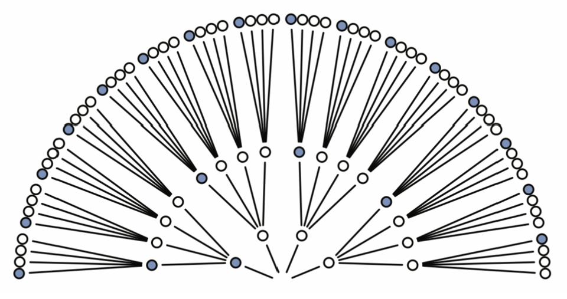{width=62%}

## 计数 ②：删除与数据不一致的路径

- 我们观察到的是“蓝白蓝”：**第 1、3 次必须是蓝，第 2 次必须是白**；
- 把所有不符合这一模式的路径删掉后，64 条中只剩下 **3 条**。

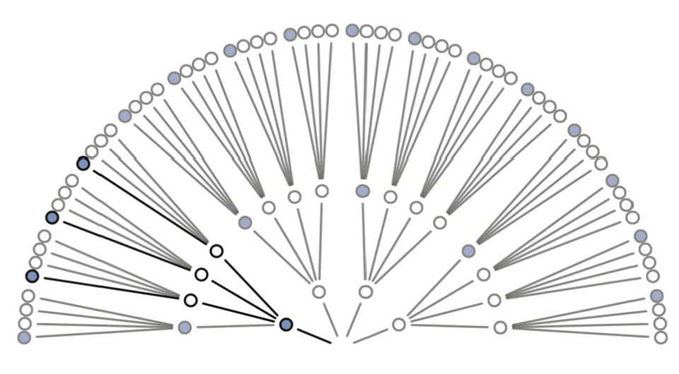{width=60%}

（在“蓝白白白”下：第 1 次蓝有 1 种 × 第 2 次白有 3 种 × 第 3 次蓝有 1 种 = **3 种方式**）

## 计数 ③：对 5 种推测逐一计数

同样的计数方法，对 5 种推测各做一遍：在每种推测下，能产生“蓝白蓝”这一数据的方式有多少种？

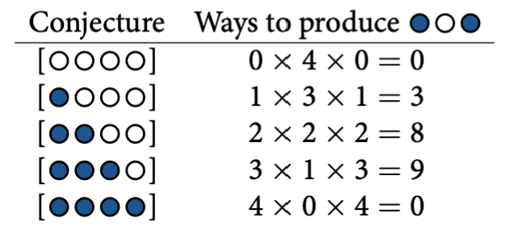{width=72%}

## 计数 ④：各推测的“方式数” (ways)

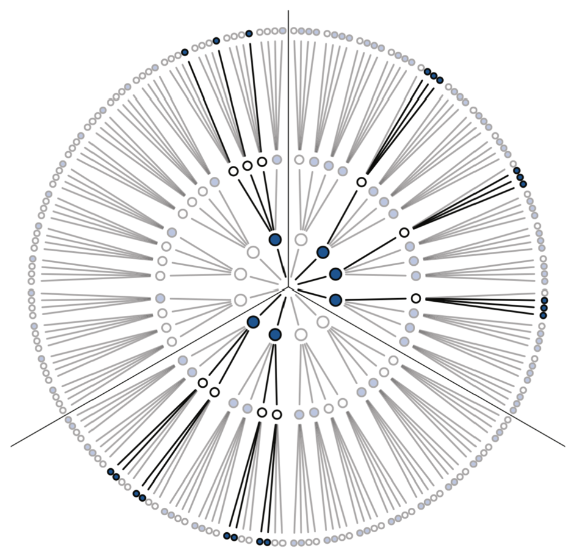{width=40%}

::: {style="font-size:0.82em"}
- 例如“蓝白白白”：1（蓝）× 3（白）× 1（蓝）= **3 种方式**；
- 全部 5 种推测的方式数为：**0 / 3 / 8 / 9 / 0** —— 数据最支持“蓝蓝蓝白”，而“全白”与“全蓝”被完全排除。
:::

## 更新：第 4 次又抽到蓝色（数据 = “蓝白蓝蓝”）

- 假设再抽一次，又得到一颗**蓝色**小球 → 以“蓝白蓝”为已知信息，继续追加计数；
- 例：“蓝蓝白白”：产生“蓝白蓝”有 8 种方式，第 4 次抽到蓝再乘 2 → **8 × 2 = 16 种**；
- 各推测更新为：**0 / 3 / 16 / 27 / 0** —— 数据越积越多，对“高蓝比例”的推测越来越有利。

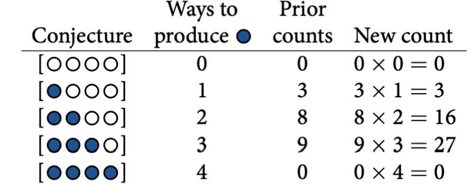{width=68%}

## 从计数到概率：归一化 (normalizing)

统计中更常用**概率**而不是原始计数——办法是让所有推测的概率加起来等于 1：

- 每一种推测的 plausibility = 该推测的计数 ÷ 所有推测计数之和；
- 例：看到“蓝白蓝”后，“蓝白白白”（$\theta = 0.25$）的 plausibility = 3 ÷ 20 = **0.15**。

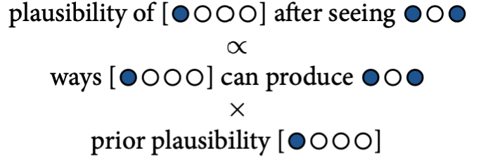{width=42%}

## 推测的先验概率：$P(\theta)$ (Prior)

- 记蓝色小球占比为 $\theta$：$\theta \in \{0,\ 0.25,\ 0.5,\ 0.75,\ 1\}$（对应 5 种推测）；
- 看到数据之前，我们默认 5 种推测**等可能**：每个 $\theta$ 的先验概率 $P(\theta) = 1/5 = 0.2$；
- **先验 (prior)**：观察数据之前，对每个假设为真的初始信念。

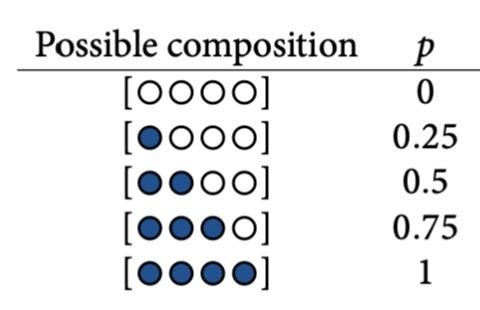{width=46%}

## 用“计数”理解贝叶斯四个关键术语

| 计数视角 | 术语 | 记号 |
|---|---|---|
| ways：假设 $\theta$ 能产生数据 $D$ 的方式数 | **似然 (likelihood)** | $P(D \mid \theta)$ |
| 数据之前对 $\theta$ 的信念 | **先验 (prior)** | $P(\theta)$，本例 = 0.2 |
| 所有 (似然 × 先验) 的总和 | **证据 (evidence)**，即归一化常数 | $P(D)$ |
| 数据之后更新过的信念 | **后验 (posterior)** | $P(\theta \mid D)$ |

$$
P(\theta \mid D) = \frac{P(D\mid \theta)\, P(\theta)}{P(D)} = \frac{\text{ways} \times \text{prior}}{\text{所有 (ways × prior) 之和}}
$$

## 完整计算：从先验 × 似然到后验

以 $\theta = 0.5$（“蓝蓝白白”）为例：

- 分子：ways × prior = 8 × 0.2 = **1.6**；
- 分母：0×0.2 + 3×0.2 + 8×0.2 + 9×0.2 + 0×0.2 = 0.6 + 1.6 + 1.8 = **4.0**；
- 后验：1.6 ÷ 4.0 = **0.40**，即看到“蓝白蓝”后，$\theta=0.5$ 的 plausibility。

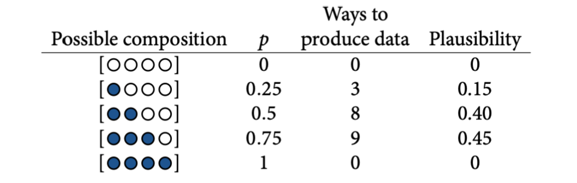{width=74%}

## 第 4 次抽到蓝：计数 vs 概率（对照）

{width=56%}

| $\theta$ | 似然 $P(\text{蓝}\mid\theta)=\theta$ | 新先验（= 旧后验） | 乘积 | 新后验 |
|---|---|---|---|---|
| 0 | 0 | 0 | 0 | 0 |
| 0.25 | 0.25 | 0.15 | 0.0375 | 0.065 |
| 0.50 | 0.50 | 0.40 | 0.2000 | 0.348 |
| 0.75 | 0.75 | 0.45 | 0.3375 | 0.587 |
| 1 | 1 | 0 | 0 | 0 |

## 对照说明：两种算法，同一答案

数据更新为“蓝白蓝蓝”后，第 15 页（计数）与第 20 页（概率表）殊途同归：

- **计数**：4 次方式数 = 0 / 3 / 16 / 27 / 0（如“蓝蓝白白”：8 × 2 = 16）
- **概率**：新先验 = 旧后验 [0, .15, .40, .45, 0]，似然 $P(\text{蓝}\mid\theta)=\theta$ → 证据 = 0.575 → 新后验 **[0, .065, .348, .587, 0]**

为什么一致？

- 计数归一化 3/46 ≈ .065、16/46 ≈ .348、27/46 ≈ .587——两列结果**逐格相等**
- 区别只是“一次数完 4 次”与“先 3 次、后 1 次分步更新”
- **上一步的后验 = 下一步的先验**：贝叶斯更新可以一步步进行，这就是“从证据中学习”的迭代本质

## 小结：贝叶斯模型的基本语言

- **参数 (parameter)**：描述总体的未知量（本例为蓝色小球占比 $\theta$）；在贝叶斯框架中参数被视为随机变量；
- **先验 (prior)**：观察数据之前对参数分布的假设；
- **似然 (likelihood)**：在不同参数假设下，当前数据出现的可能性（方式数）；
- **证据 (evidence)**：所有参数假设下（似然 × 先验）之和，用于归一化得到后验；
- **后验 (posterior)**：观察数据之后更新过的参数分布：后验 ∝ 先验 × 似然；它也可以作为**下一轮更新的先验**。

## 与以往学的“统计”有何不同？

::: {style="font-size:0.85em"}
- 经典统计通常**先假设参数已知/固定**，再问“数据有多罕见”；
- 贝叶斯相反：**参数未知**，用数据不断更新对参数的信念；
- **小世界 vs 大世界**：贝叶斯模型所刻画的小世界（哥伦布以为的地球周长 3 万公里）vs 模型运行的真实环境（实际 4 万公里）；
- 当模型的假设与现实相近时，贝叶斯模型在大世界中也会表现良好。

:::

{width=32%}

## Part 3: 随机变量的贝叶斯模型 (Bayesian models with random variables)

### 从“推测袋中小球的组成”到“随机变量”

在 Part 2 中，我们用 $\theta$ 表示蓝色小球占比，$\theta$ 只有 5 种离散取值。同样的贝叶斯更新逻辑，现在用于一个**真实的心理学场景**：

假设一个有实力、有经费的团队计划对 **6 项研究**进行重复实验，想知道“能成功重复多少项”。

- 成功率 $\theta$ 是**未知且可能变化**的 → 它是一个随机变量（像 $\theta$ 一样需要被推断）；
- 成功复现的次数 $Y$ 可能是 0、1、…、6 中的任意值：$Y \in \{0,1,2,3,4,5,6\}$；
- 类比：斗地主里的“胜率”——每轮玩完都在变，开局前你并不知道这一轮会是多少。

🤔 即便团队的真实水平约为 $\theta = 50\%$，$Y=0$ 到 $Y=6$ 每种结果的**可能性**分别是多少？

## 二项式模型 (The binomial model)

每次重复实验只有两种结果（成功 vs 失败），$n=6$ 次独立实验的成功次数 $Y$ 服从二项分布：

$$
f(y|\theta) = \binom{n}{y}\, \theta^{y}(1-\theta)^{n-y} \qquad y \in \{0,1,\dots,n\}, \quad \binom{n}{y}=\frac{n!}{y!(n-y)!}
$$

模型的前提假设：

- 所有试次（各研究的重复实验）**相互独立**；
- 每次试次的成功概率都是同一个固定值 $\theta$。


> 对应 Python 实现见 `Lecture2.py`：`scipy.stats.binom.pmf(y, n, p)`。

## 用 R 计算概率质量函数 (PMF)

以 $\theta = 0.5,\ n = 6$ 为例，逐项计算 $f(y|\theta)$：

```{r}
# 成功次数、总次数、假设的成功率
y <- 0:6
n <- 6
p <- 0.5

# 计算每个 y 的概率
prob <- dbinom(y, size = n, prob = p)
result_table <- data.frame(y = y, prob = round(prob, 4))
print(result_table, row.names = FALSE)

cat("所有概率之和 =", sum(prob), "\n")
```

## 概率质量函数 (Probability mass function)

**PMF** 描述离散型随机变量取各个可能值时的概率：$f(y) = P(Y = y)$。

- $Y$ 的取值有限（或可数），称**离散型随机变量**；
- 性质 1：对所有 $y$，$0 \le f(y) \le 1$；
- 性质 2：$\sum_{\text{all } y} f(y) = 1$（上一步代码已验证）。

```{r}
#| fig-width: 9.2
#| fig-height: 3.2
ggplot(result_table, aes(x = y, y = prob)) +
  geom_segment(aes(xend = y, yend = 0), color = "gray", linewidth = 1) +
  geom_point(size = 3) +
  xlim(-0.2, 6.2) +
  scale_y_continuous(expand = c(0, 0), limits = c(0, 0.4)) +
  labs(x = "y", y = "f(y | θ)") +
  papaja::theme_apa()
```

当 $\theta = 0.5$ 时，$y=3$（成功 3 项）的概率最高：$f(3|0.5)=0.3125$。

## 二项似然函数 (The binomial likelihood): 不同信念

并非所有人都认为成功率是 50%：

- **中立派**（团队自己估计）：$\theta = 0.5$
- **乐观派**：$\theta = 0.8$（对团队高度有信心）
- **悲观派**：$\theta = 0.2$（不太看好）

不同 $\theta$ 意味着对 $Y$ 的不同预期。分别计算三种 $\theta$ 下的 $f(y|\theta)$：

```{r}
# 三种成功概率下的 f(y|θ)
y <- 0:6
p_values <- c(0.5, 0.8, 0.2)
likelihoods <- sapply(p_values, function(p) dbinom(y, size = 6, prob = p))

result_table3 <- round(data.frame(y = y, likelihoods), 4)
names(result_table3) <- c("y", "中立派 θ=0.5", "乐观派 θ=0.8", "悲观派 θ=0.2")
print(result_table3, row.names = FALSE)
```

## 三派眼中的 $Y$ 分布

```{r}
#| fig-width: 13.5
#| fig-height: 5
plots <- list()
titles <- c("Team itself (θ = 0.5)", "Optimists (θ = 0.8)", "Pessimists (θ = 0.2)")

for (i in seq_along(p_values)) {
  plots[[i]] <- ggplot(
    data.frame(y = y, lik = likelihoods[, i]),
    aes(x = y, y = lik)
  ) +
    geom_segment(aes(xend = y, yend = 0), color = "gray", linewidth = 1) +
    geom_point(size = 3) +
    labs(title = titles[i], y = "f(y | θ)") +
    xlim(-0.2, 6.2) +
    scale_y_continuous(expand = c(0, 0), limits = c(0, 0.45)) +
    papaja::theme_apa()
}
gridExtra::grid.arrange(grobs = plots, ncol = 3)
```

- 乐观派（0.8）认为“成功很多项”最可能；悲观派（0.2）认为“全败/几乎全败”最可能。

## 观察到 $y = 1$：谁的信念更合理？

假设团队 6 项研究**只成功复现了 1 项**。在三派设定的成功率下，这件事的可能性分别是：

```{r}
# 只成功 1 次时，不同 θ 下的似然
y_obs <- 1
lik_obs <- sapply(p_values, function(p) dbinom(y_obs, size = 6, prob = p))
lik_tab <- data.frame(theta = p_values, L_pi_y1 = round(lik_obs, 4))
print(lik_tab, row.names = FALSE)
```

- $\theta=0.2$ 时最可能出现 $y=1$（0.3932），$\theta=0.8$ 时几乎不可能（0.0015）；
- 若团队真的只成功 1 项，那么成功率**更可能偏低**——悲观派的情境得到了数据的支持。

## 似然函数 $L(\theta | y=1)$

当数据固定为 $y=1$ 时，把它看成 $\theta$ 的函数：

$$
f(Y=1|\theta) = \binom{6}{1} \theta^1 (1-\theta)^{5} = 6\theta(1-\theta)^5 = L(\theta | y=1)
$$

| $\theta$ | 0.2 | 0.5 | 0.8 |
|---|---|---|---|
| $L(\theta \mid y=1)$ | 0.3932 | 0.0938 | 0.0015 |

注意（与 Part 2 一致）：
1. 似然函数只随 $\theta$ 变化，数据 $y=1$ 已经固定；
2. 不同 $\theta$ 下似然的**总和不等于 1**——它只是相对支持度的比较。

## 条件概率 vs 似然函数

- **$\theta$ 固定、$y$ 变化**：$f(y_1|\theta)$ vs $f(y_2|\theta)$ —— 在给定模型下“预测”不同数据的概率；
- **$y$ 固定、$\theta$ 变化**：$L(\theta_1|y)$ vs $L(\theta_2|y)$，即 $f(y|\theta_1)$ vs $f(y|\theta_2)$ —— 在给定数据下“比较”不同模型。

$$
Y \mid \theta \sim \text{Bin}(6, \theta), \qquad f(y|\theta) = \binom{6}{y}\theta^y(1-\theta)^{6-y}
$$

## 同一数据在各模型下的似然

```{r}
#| fig-width: 13.5
#| fig-height: 5
y <- 0:6
theta_values <- c(0.2, 0.5, 0.8)
plots <- list()

for (i in seq_along(theta_values)) {
  pi_v <- theta_values[i]
  lik_y <- dbinom(y, size = 6, prob = pi_v)
  y1_lik <- dbinom(1, size = 6, prob = pi_v)

  p <- ggplot(data.frame(y = y, lik = lik_y), aes(x = y, y = lik)) +
    geom_segment(aes(xend = y, yend = 0), color = "black") +
    geom_segment(x = 1, y = 0, xend = 1, yend = y1_lik, color = "red", linewidth = 1.6) +
    geom_point(size = 3) +
    labs(title = paste0("Bin(6, ", pi_v, ")"), x = "y") +
    scale_y_continuous(expand = c(0, 0), limits = c(0, 0.5)) +
    papaja::theme_apa()
  plots[[i]] <- p
}
gridExtra::grid.arrange(grobs = plots, ncol = 3)
```

红色竖线 = 同一数据 $y=1$ 在不同 $\theta$（模型）下的似然：**从左到右急剧下降**——数据强烈支持低成功率。

## 先验概率模型 (Prior probability model for $\theta$)

像 Part 2 一样，我们也可以对“哪个 $\theta$ 更可能”赋予先验信念。假如我们总体上偏乐观、但不排除其他观点：

| $\theta$ | 0.2 | 0.5 | 0.8 | Total |
|---|---|---|---|---|
| $f(\theta)$ | 0.10 | 0.25 | 0.65 | 1 |

$\theta$ 的取值数量也可以扩展（例如再加入非常悲观的 $\theta=0.01$）：

| $\theta$ | 0.01 | 0.2 | 0.5 | 0.8 | Total |
|---|---|---|---|---|---|
| $f(\theta)$ | 0.10 | 0.10 | 0.25 | 0.55 | 1 |

原则不变：**穷尽所有可能、和为 1** —— 这就是 $\theta$ 的先验模型。

## 观察数据后：计算后验 $f(\theta | y=1)$

团队最终只成功复现 1 项。先验 $f(\theta)$ 遇到似然 $L(\theta|y=1)$，按贝叶斯公式更新：

$$
f(\theta|y{=}1) = \frac{f(\theta)\,L(\theta|y{=}1)}{f(y{=}1)} = \frac{f(\theta)\,L(\theta|y{=}1)}{\sum_{\text{all } \theta} f(\theta)\,L(\theta|y{=}1)}
$$

先计算分母：$f(y{=}1) = 0.10\times0.3932 + 0.25\times0.0938 + 0.65\times0.0015 \approx 0.0637$

| $\theta$ | $f(\theta)$ | $L(\theta\mid y{=}1)$ | $f(\theta)L(\theta\mid y{=}1)$ | $f(\theta\mid y{=}1)$ |
|---|---|---|---|---|
| 0.2 | 0.10 | 0.3932 | 0.03932 | 0.617 |
| 0.5 | 0.25 | 0.0938 | 0.02345 | 0.368 |
| 0.8 | 0.65 | 0.0015 | 0.00098 | 0.015 |

团队“高成功率”（$\theta=0.8$）的信念从 0.65 骤降到 **0.015**——只成功 1 项是反对高成功率的强证据。

## 先验 → 似然 → 后验

```{r}
#| fig-width: 13.5
#| fig-height: 5
# 参数取值与先验
theta_values <- c(0.2, 0.5, 0.8)
prior_theta  <- c(0.10, 0.25, 0.65)

# 真实似然：观察到 y = 1
lik_theta <- dbinom(1, size = 6, prob = theta_values)

# 后验 = 先验 × 似然 / 归一化
post_theta <- prior_theta * lik_theta / sum(prior_theta * lik_theta)

plot_pi <- function(title, vals, ymax = 0.7) {
  ggplot(data.frame(theta = theta_values, v = vals), aes(x = theta, y = v)) +
    geom_segment(aes(xend = theta, yend = 0), color = "black", linewidth = 1.2) +
    geom_point(size = 3) +
    labs(title = title, x = expression(theta), y = "Probability") +
    scale_y_continuous(expand = c(0, 0), limits = c(0, ymax)) +
    scale_x_continuous(breaks = theta_values, limits = c(0.1, 0.9)) +
    papaja::theme_apa()
}

p1 <- plot_pi("Prior f(θ)", prior_theta)
p2 <- plot_pi("Likelihood L(θ|y=1)", lik_theta)
p3 <- plot_pi("Posterior f(θ|y=1)", post_theta)
gridExtra::grid.arrange(grobs = list(p1, p2, p3), ncol = 3)
```

## 补充材料：后验 ∝ 先验 × 似然（省略分母！）

分母 $f(y)$ 是一个与 $\theta$ 无关的**归一化常数**：

$$
f(\theta | y) = \frac{f(\theta)L(\theta|y)}{f(y)} \;\propto\; f(\theta)\,L(\theta|y) \qquad \Rightarrow \qquad \text{posterior} \propto \text{prior} \times \text{likelihood}
$$

省略分母后（未归一化）：

- $f(\theta{=}0.2|y{=}1) \propto 0.10 \times 0.3932 = 0.03932$
- $f(\theta{=}0.5|y{=}1) \propto 0.25 \times 0.0938 = 0.02345$
- $f(\theta{=}0.8|y{=}1) \propto 0.65 \times 0.0015 = 0.00098$

三者总和 0.0637，比例与完整后验（0.617/0.368/0.015）完全一致。

> 😜 这个性质很重要：分母的计算往往需要遍历/积分所有参数。如果**不算分母也能得到后验**，那后面课程介绍的 MCMC 方法就会非常实用。

## 归一化 vs 未归一化的后验

```{r}
#| fig-width: 12
#| fig-height: 5
# 未归一化与归一化后验
unnorm <- c(0.03932, 0.02345, 0.00098)
normed <- unnorm / sum(unnorm)
posterior_data <- data.frame(
  theta = rep(theta_values, 2),
  probability = c(normed, unnorm),
  type = rep(c("normalized", "unnormalized"), each = 3)
)

ggplot(posterior_data, aes(x = theta, y = probability)) +
  geom_segment(aes(xend = theta, yend = 0), color = "black", linewidth = 1.4) +
  geom_point(size = 3) +
  facet_wrap(~ type, scales = "free_y",
             labeller = labeller(type = c(normalized = "Normalized",
                                          unnormalized = "Unnormalized"))) +
  labs(x = expression(theta), y = "Probability") +
  scale_x_continuous(breaks = theta_values) +
  papaja::theme_apa() +
  theme(strip.text = element_text(size = 15))
```

两条曲线只差一个常数——**形状（比例关系）完全相同**。

## Posterior simulation：用模拟逼近后验

当 $\theta$ 的取值很多（甚至连续）时，分母的求和/积分会变得困难。另一个思路是：**不解析计算，直接抽样**。

1. 从先验 $f(\theta)$ 中抽取大量 $\theta$；
2. 对每个 $\theta$，按数据模型模拟 $y \sim \text{Bin}(6, \theta)$；
3. 只保留 $y = 1$ 的那些样本；
4. 这些样本中 $\theta$ 的分布，就是**模拟的后验** $f(\theta | y{=}1)$。

## 模拟第 1–2 步：抽 $\theta$、模拟 $y$

```{r}
# 1. 定义可能的成功率与先验
replicated <- data.frame(theta = c(0.2, 0.5, 0.8))
prior_theta   <- c(0.10, 0.25, 0.65)

# 2. 从先验抽取 10000 个 θ，并在每个 θ 下模拟成功次数 y
set.seed(84735)
sim_idx <- sample(1:3, size = 10000, replace = TRUE, prob = prior_theta)
replicated_sim <- replicated[sim_idx, , drop = FALSE]
replicated_sim$y <- rbinom(nrow(replicated_sim), size = 6, prob = replicated_sim$theta)

head(replicated_sim, 10)
```

## 检查抽到的 $\theta$：比例应接近先验 (10% / 25% / 65%)

```{r}
replicated_sim %>%
  dplyr::count(theta) %>%
  dplyr::mutate(percent = round(100 * n / sum(n), 2)) %>%
  print()
```

## 模拟第 3 步：不同 $\theta$ 下的 $y$ 分布 $f(y|\theta)$

```{r}
#| fig-width: 13.5
#| fig-height: 5
ggplot(replicated_sim, aes(x = y)) +
  geom_bar(aes(y = after_stat(prop), group = 1),
           fill = "skyblue", color = "black", width = 0.7) +
  facet_wrap(~ theta, labeller = label_both) +
  scale_x_continuous(breaks = 0:6, limits = c(-0.5, 6.5)) +
  scale_y_continuous(expand = c(0, 0)) +
  labs(y = "f(y | θ)") +
  papaja::theme_apa() +
  theme(strip.text = element_text(size = 15))
```

每个面板内的条形 = 给定 $\theta$ 时 $Y$ 的条件分布——与前面手算的 PMF 形状一致。

## 模拟第 4 步：只看 $y=1$ 的样本 → 模拟后验

```{r}
# 条件于 y = 1
replicated_post <- replicated_sim %>% filter(y == 1)

# 模拟后验中各 θ 的比例
post_counts <- replicated_post %>%
  dplyr::count(theta) %>%
  dplyr::mutate(proportion = round(n / sum(n), 3))
print(post_counts)
```

## 模拟后验 vs 解析后验

```{r}
#| fig-width: 11
#| fig-height: 5
# 解析后验 (来自前面的精确计算)
exact_post <- data.frame(
  theta = c(0.2, 0.5, 0.8),
  proportion = c(0.617, 0.368, 0.015),
  type = "exact"
)
sim_post <- data.frame(
  theta = post_counts$theta,
  proportion = post_counts$proportion,
  type = "simulation"
)

ggplot(rbind(exact_post, sim_post), aes(x = factor(theta), y = proportion, fill = type)) +
  geom_col(position = position_dodge(0.7), width = 0.6) +
  scale_fill_manual(values = c("exact" = "gray50", "simulation" = "skyblue")) +
  labs(x = expression(theta), y = "Posterior probability", fill = "approach") +
  papaja::theme_apa()
```

- 模拟后验与解析后验（0.617 / 0.368 / 0.015）几乎重合；
- 差异来自抽样波动——把 10000 换成更大的数字会进一步缩小。

## 思考：频率学派会如何处理这两个问题？

回顾本讲的两个推断问题：

1. 袋中蓝色小球占比 $\theta$：$P(\theta \mid \text{蓝白蓝})$（Part 2 的计数例）；
2. 6 项研究的成功率 $\theta$：$f(\theta | y{=}1)$（Part 3）。

🤔 频率学派（经典统计）会怎样回答？它们与贝叶斯学派的根本分歧在哪里？

> 带着问题进入 Part 4；相关练习见课程的闯关题。

## Part 4: 频率学派与贝叶斯学派的对比 (Frequentist vs. Bayesian)

### 同一份数据，两种结论：ECMO 临床试验

{width=39%}

::: {style="font-size:0.66em"}
- **频率学派**：计划 331 名患者，因中期分析未能证明获益而提前停止（249 人）。干预组死亡率 35% vs 对照组 46%，但 $p = 0.09 > 0.05$ → “证据不足，不能证明 ECMO 有效”；
- **贝叶斯学派**：在不同先验下，$H_1$（ECMO 有效）成立的后验概率高达 **88%～99%** → “强有力的证据支持 ECMO”。

> Goligher, E. C., Heath, A., & Harhay, M. O. (2024). Bayesian statistics for clinical research. *The Lancet*, 404(10457), 1067–1076.
:::

## 频率学派如何看待这个世界？

1. **假设是固定的**：零假设 $H_0$ 是一个固定为真/假的命题；
2. **数据是随机的**：在 $H_0$ 为真的前提下，数据可以被反复抽样；
3. **推断依赖“无限重复实验”**：$p$ 值 = 在 $H_0$ 下观测到当前数据或更极端数据的（假想重复）概率；置信区间同样基于重复抽样的频率性质；
4. **决策二分**：预设显著性水平（如 0.05），$p < \alpha$ 则拒绝 $H_0$。

本例中：$p = 0.09$ → 未达到 0.05 → 不拒绝 $H_0$ → 结论“证据不足”。

## 贝叶斯学派如何看待这个世界？

概率是对不确定性的**主观度量**，因此可以直接谈论“假设为真的概率”：

1. **先验**：从对假设的初始信念出发（来自以往研究、专家意见、临床经验）；
2. **更新**：新数据通过似然函数与先验结合，得到**后验概率**；
3. **直接的概率陈述**：如“$H_1$ 成立的后验概率为 88%”，以及更直观的**可信区间 (credible interval)**。

本例中：不同的合理先验都得到 $H_1$ 后验 ≥ 88%，故结论是“强支持 ECMO”。

## 两位奠基人：Bayes 与 Laplace

- **Thomas Bayes (1701–1761)**：英国牧师与数学家；提出逆概率问题的解法，论文在其身后（1763）才发表；
- **Pierre-Simon Laplace (1749–1827)**：法国数学家；独立重新发现该定理，并给出今天通用的形式（含先验/归一化表述）。

::: {layout-ncol="2"}
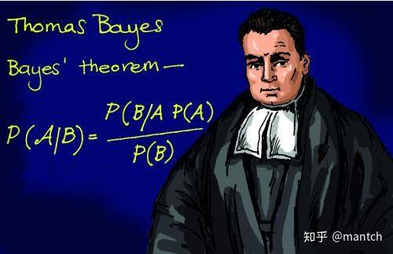{width=50%}

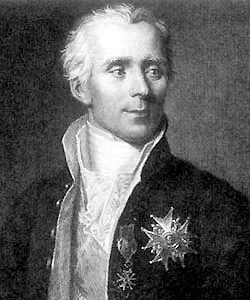{width=42%}
:::

## 两个学派的差异对比

| 频率学派 (Frequentist) | 贝叶斯学派 (Bayesian) |
|---|---|
| 概率 = 无限重复试验中的**频率** | 概率 = 对假设的**信念度量** |
| 假设是固定的，数据是随机的 | 假设是随机的，数据是固定的 |
| 通过 $p$ 值检验是否拒绝 $H_0$ | 用先验 + 数据更新出后验概率 |
| 置信区间：重复试验中 95% 覆盖真值 | 可信区间：参数落在区间内的概率为 95% |
| 只基于当前数据，不考虑先验 | 结合历史信息/专家意见 |
| 实验设计固定，不能中途调整 | 支持自适应设计与决策 |
| 无法直接支持 $H_0$ | 可直接比较多个假设 |

来源：Goligher et al. (2024)

## 贝叶斯的主观性：没有绝对客观的统计

**主观性是相对的**：

- 贝叶斯学派把主观性**显式放进先验**：透明、可讨论、可检验；
- 频率学派的主观性则藏在**前提预设**里：方差齐性、正态性……看似“客观”却难以满足；
- 样本抽取、数据清理、分析方法与 $\alpha$ 水平的选择，处处都有主观判断；
- 主观不一定是坏事：它把个体经验与专家知识**量化**进分析。

## 重复抽样：两派眼中的不同角色

**频率学派**
- 推断依赖参数的**抽样分布**（long-run 重复实验的假想）；
- $p$ 值与置信区间都建立于“可无限重复抽样”之上；
- 现实中往往只收集一次数据，“无限重复”只是一个思想实验。

**贝叶斯学派**
- 参数本身就是分布，不确定性直接进入推断；
- 只需这一次数据，即可更新信念。

> 置信区间 (CI) vs 可信区间 (CrI)：**没有免费的午餐**——两派各有优势与局限。

## 不同的先验/似然 → 不同的后验

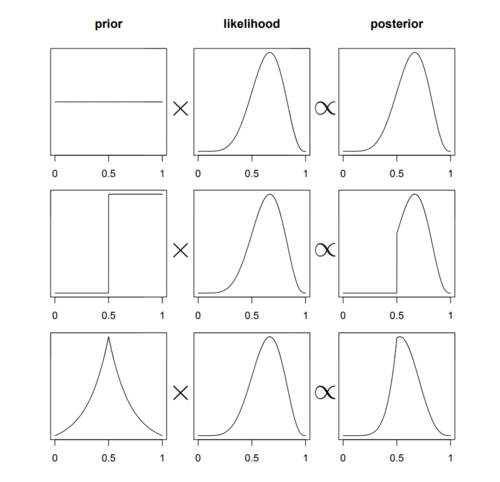{width=34%}

- 后验 = 先验 × 似然（再归一化）：**先验与似然都会塑造后验**；
- 先验差异大时，后验的差异也会明显——因此贝叶斯分析要求**先验要透明、理由要充分**；
- 数据量足够大时，不同先验的后验会趋于一致（数据会“压过”先验）。

## NHST 的“弱项”

- **无法直接支持零假设**：即使“没有显著差异”，也不知道两个总体有多相似（许岳培 等, 2023, *应用心理学*)；
- **一次只能比较两个假设**：多假设、多模型的情形难以处理；
- **控制假阳性很棘手**：多重比较、p-hacking、发表偏倚等问题叠加。

> 这些局限推动了学界对贝叶斯方法（以及更严谨的频率学派实践）的重视。

## 本讲总结 (Recap)

- **单一事件**：先验 $P(B)$ × 似然 $P(A|B)$ → 后验 $P(B|A)$（别忘了分母 $P(A)$）；
- **随机变量**：二项模型 $Y|\theta \sim \text{Bin}(6, \theta)$，同样的逻辑作用于 $\theta$ 的分布；
- **Posterior simulation**：抽样代替解析计算——这是通向 MCMC 的桥梁；
- **两派对比**：概率的定义、随机性的归属、先验的角色各不相同。

> 📌 预告第 3 讲：连续型参数（β 分布）与更一般的贝叶斯建模。

## 参考文献 (References)

- McElreath, R. (2020). *Statistical Rethinking: A Bayesian Course with Examples in R and Stan* (2nd ed.). CRC Press.（Part 2 小球例出处）
- Goligher, E. C., Heath, A., & Harhay, M. O. (2024). Bayesian statistics for clinical research. *The Lancet*, 404(10457), 1067–1076.
- 许岳培 等 (2023). *应用心理学*, (04), 369–384.

## 附：Python 对照代码

本讲的示例均有对应的 **Python 实现**，整理在课程根目录的 `Lecture2.py` 中：

- **Part 2 计数例**：`ways = [0, 3, 8, 9, 0]` → `plaus = ways / sum(ways)` 得后验；顺序更新用“似然 × 旧后验”再归一化（约 5 行 numpy）；
- **Part 3 二项分布**：`scipy.stats.binom.pmf(y, n, p)` 与 10000 次模拟（`np.random.seed(84735)` 保持一致）；
- 另含基于 Herzenstein 等 (2024) 数据的**可重复性练习**（延伸阅读，对应旧版讲义）。

> 运行方式：`python Lecture2.py`（需已安装 pandas、numpy、matplotlib、scipy；建议用和鲸平台 `pyBayesian` 环境或本地 conda 环境）。